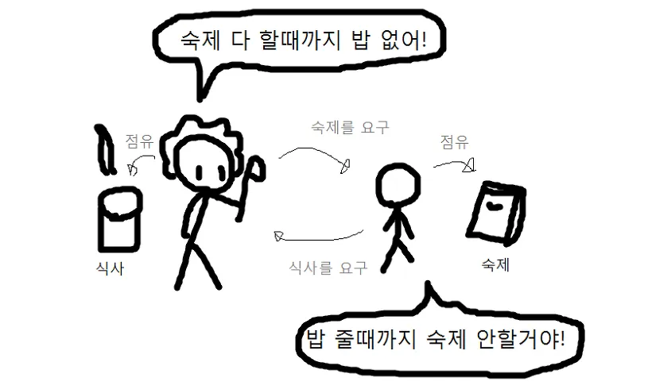

# 데드락(DeadLock)

## 데드락(Dead Lock) 이란?

데이터베이스에서 교착상태(Dead Lock)는 여러 개의 트랜잭션(Transaction)들이 실행을 하지 못하
고 서로 무한정 기다리는 상태를 의미한다. 

데이터베이스의 특정 테이블, 행, 인덱스와 같은 논리적 리소스에 대한 잠금(lock) 경쟁에 의해 발생하게 된다.

위 그림이 데드락을 한 눈에 이해하기 좋은 것 같다.

트랜잭션 A가 리소스 1(예를 들어, 특정 데이터 행)을 잠그고 리소스 2가 필요해 기다리고 있고,  
동시에, 트랜잭션 B가 리소스 2를 잠그고 리소스 1이 필요해 기다리고 있다면
서로가 서로의 자원을 해제하기를 기다리기 때문에, 둘 다 진행할 수 없는 상태가 된다.

## 데드락 발생 조건

데드락은 데이터이스에서는 트랜잭션 간의 잠금(locking) 문제와 관련이 있고, 운영체제에서는 프로세스 간의 자원 경쟁과 관련이 있다.  
데드락 발생 조건은 운영체제와 데이터베이스 모두 동일한 4가지 조건을 따른다.(시스템 자원에 자원의 사용, 대기에 대한 일반적인 원칙이기 때문)  
운영체제에서 프로세스에 대한 내용이, 데이터베이스에서는 트랜잭션으로 바뀐 정도로 생각할 수 있을 것 같다.

1. 상호 배제(Mutual Exclusion): 리소스는 한 번에 하나의 트랜잭션만 사용할 수 있다.
2. 점유 대기(Hold and Wait): 트랜잭션은 이미 할당된 리소스를 보유한 채로 다른 리소스를 요청할 수 있다.
3. 비선점(No Preemption): 트랜잭션이 할당받은 리소스는 자발적으로 해제되기 전까지 다른 트랜잭션이 강제로 가져갈 수 없다.
4. 순환 대기(Circular Wait): 두 개 이상의 트랜잭션이 서로를 기다리는 순환적인 대기 상태가 존재한다.

