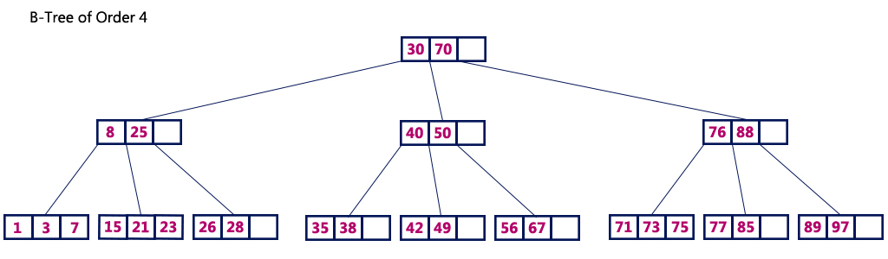
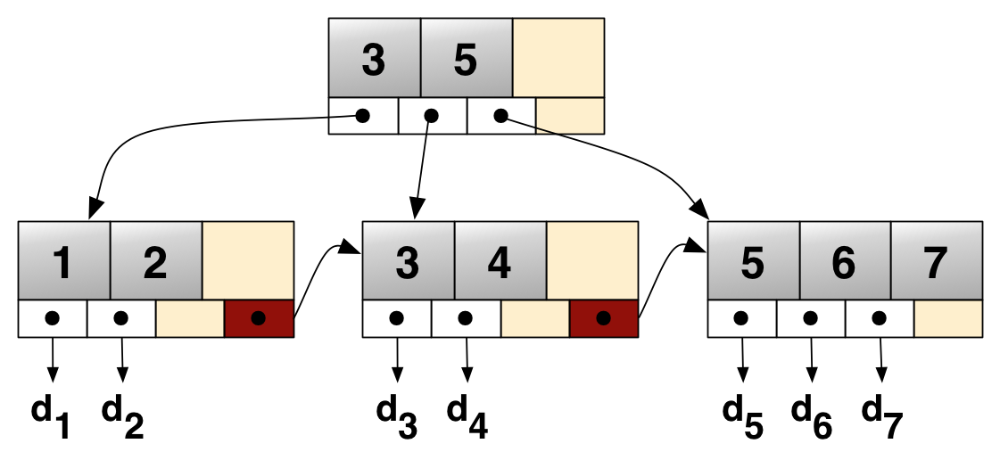
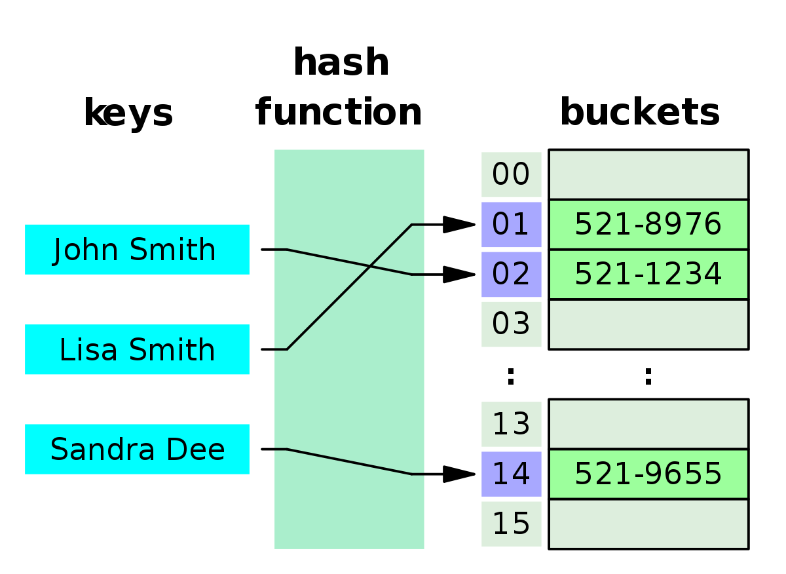
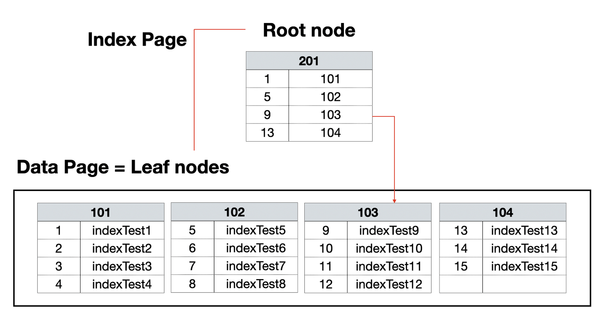
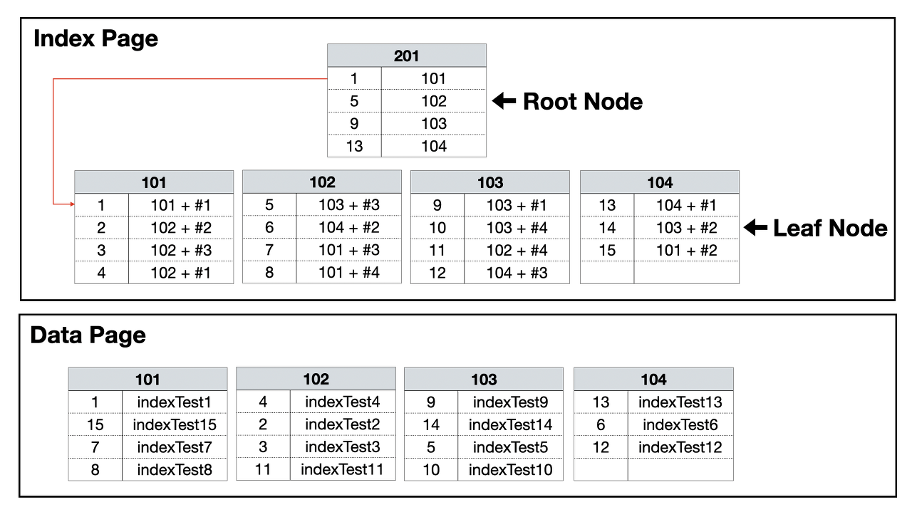

# 인덱스 기본 개념

## 인덱스란?

인덱스는 데이터베이스에서 데이터를 빠르게 검색하기 위한 자료구조다. 

책의 목차와 유사한 개념으로 인덱스의 개별 항목은 **인덱스 엔트리**라 하며, 특정 컬럼의 값과 해당 레코드의 위치를 쌍으로 저장한다. 

인덱스를 사용하면 전체 테이블을 스캔하지 않고도 원하는 데이터를 빠르게 찾을 수 있어 쿼리 성능을 향상시킬 수 있다.

## 인덱스 관리

DBMS는 index를 항상 최신의 정렬된 상태로 유지해야 원하는 값을 빠르게 탐색할 수 있다. 
그렇기 때문에 인덱스가 적용된 컬럼에 INSERT, UPDATE, DELETE가 수행된다면 각각 다음과 같은 연산이 추가적으로 발생한다.

INSERT: 새로운 데이터에 대한 인덱스를 추가함
DELETE: 삭제하는 데이터의 인덱스를 **사용하지 않음** 처리
UPDATE: 기존의 인덱스를 사용하지 않음 처리하고, 갱신된 데이터에 대해 인덱스를 추가함

> **인덱스의 "사용하지 않음" 처리의 의미**  
> 데이터가 삭제되거나 수정할 때, 해당 인덱스를 즉시 물리적으로 제거하지 않는다. 대신 해당 엔트리를 논리적으로 비활성화하거나 마킹한다.
> 데이터베이스 시스템은 백그라운드 프로세스를 통해 점진적으로 불필요한 인덱스 엔트리를 정리한다.

## 인덱스의 장단점

### 장점
- 테이블 검색 속도와 시스템 성능이 향상된다
- 전반적인 시스템 부하가 감소한다

### 단점
- 추가 저장 공간이 필요하다  
- 인덱스 관리를 위한 추가 작업이 발생한다
- 잘못 사용하면 성능이 저하될 수 있다

INSERT, UPDATE, DELETE 작업이 빈번한 속성에 인덱스를 걸면 인덱스의 크기가 비대해져 성능이 오히려 저하되는 역효과가 발생할 수 있다.

## 인덱스 자료구조

### B Tree

B-Tree 는 탐색 성능을 높이기 위해 균형 있게 높이를 유지하는 Balanced Tree 의 일종이다. 모든 leaf 노드가 같은 level 로 유지되도록 자동으로 밸련스를 맞춰 준다.
노드 들이 여러 개의 자식 노드를 가질 수 있다. 노드에는 key 와 데이터에 data 가 저장된다. B-Tree의 모든 노드는 정렬되어 있으며, 검색, 삽입, 삭제 시 O(log n)의 시간 복잡도를 가진다.
데이터가 정렬된 상태를 유지하기 때문에 등호(=) 뿐 아니라 부등호 (<,>) 연산이 가능하다.

### B+Tree

B+Tree 는 B-Tree 를 기반으로 한 개선된 트리 구조로 대부분의 데이터베이스 시스템은 B+Tree 구조를 사용한다.
B-Tree 와 마찬가지로 노드에 여러 자식 노드를 가질 수 있고 균형이 유지된다. B-Tree 와 다르게 오직 리프 노드에만 key 와 data 를 저장하고, 리프 노드끼리 Linked list로 연결되어 있다.
리프 노드들이 Linked list 연결되어 있기 때문에 범위 검색이나 순차적인 데이터 접근 시 매우 효율적이다.
- `BETWEEN`, `ORDER BY`

> **노드에 key 와 data 가 들어간다는 의미**  
> key: 인덱스가 걸린 칼럼의 값을 의미하며, 이 값을 기준으로 데이터베이스에서 데이터를 빠르게 검색한다.  
> data: 테이블의 해당 row 에 대한 참조 정보를 의미한다. (클러스터드 인덱스의 경우 인덱스가 걸린 컬럼과 관련된 테이블의 행 데이터 자체)

### 해시 테이블

컬럼의 값으로 생성된 해시를 기반으로 (키, 값) 형태의 인덱스를 구현한다. 해시 자료구조이므로, O(1) 매우 빠른 검색 속도를 제공한다. 
검색 시간복잡도가 O(1) 으로 매우 빠르지만, 등호(=) 연산에만 특화되어 있다는 단점이 있다. 따라서 부등호 연산(>, <)에 취약하며 범위 검색에 부적합하다. (해시 함수의 특성상 값이 조금만 달라져도 완전히 다른 해시 값을 생성한다.)
데이터베이스 검색에서는 부등호 연산이 자주 사용되므로 해시 테이블이 적합하지 않다. 이러한 이유로 일반적인 데이터베이스 인덱스에서는 B+Tree가 더 널리 사용된다.
 

## 클러스터드 인덱스와 논클러스터드 인덱스

인덱스를 생성하면 인덱스를 위한 디스크 공간이 필요하고, 인덱스를 가진 테이블에 DML 작업을 할 경우 더 많은 비용과 시간이 필요하다. 
때문에 인덱스를 생성 시 해당 테이블의 의도를 정확하게 파악한 후에 상황에 맞게 적절한 칼럼으로 Clustered Index와 Non Clustered Index를 구성해야 한다.

사진은 **B+Tree 자료구조를 바탕으로** 클러스터링 인덱스와 논 클러스터링 인덱스를 나타낸 것이다.

### 클러스터드(Clustered) 인덱스

클러스터드 인덱스는 따로 인덱스 페이지를 만들지 않고, 특정 컬럼을 기준으로 물리적으로 데이터를 정렬시킨다. 테이블 데이터의 정렬 기준으로 하나의 컬럼을 사용하기 때문에 테이블 당 하나의 클러스터형 인덱스만 존재할 수 있다.
PK 설정 시 그 칼럼은 자동으로 클러스터드 인덱스가 만들어진다. (테이블 내에서 원하는 대로 생성할 수도 있다.)
입력, 수정, 삭제 시에 항상 정렬된 상태를 유지해야 하기 때문에 중간에 새로운 데이터가 삽입된다면 이후 모든 컬럼을 한 칸씩 이동시켜줘야 한다. 따라서 Primary Key 를 어떤 컬럼으로 선택하는가에 따라 Database 성능이 좌우된다.
데이터가 정렬되어 있으므로 모든 테이블 데이터를 스캔하지 않고 원하는 데이터를 조회할 수 있다. 읽기 작업이 월등히 많은 경우 매우 빠르다.

### 논 클러스터드(Non-Clustered) 인덱스

클러스터 형의 반대인 군집화 되어있지 않은 인덱스 타입으로 테이블에 저장된 물리적인 순서에 따라 데이터를 정렬하지 않는다.
테이블 데이터와 함께 저장되는 것이 아니라 데이터 페이지는 그냥 둔 상태에서 별도의 인덱스 페이지를 따로 만들어서 저장한다. 때문에 용량을 더 차지한다.
하나의 테이블에 여러 개의 논 클러스터형 인덱스를 설정할 수 있다. 인덱스 자체의 리프 페이지는 데이터가 아니라 데이터가 위치하는 포인터(RID)이기 때문에 클러스터형보다 검색 속도는 더 느리지만 데이터의 입력, 수정, 삭제는 더 빠르다.

## 인덱스 사용 시 고려 사항들

1. 분포도: 컬럼의 값이 고르게 분포되어 있을수록 인덱스 효과가 좋다.
2. 갱신 빈도: 갱신이 빈번한 컬럼에 인덱스를 생성하면 성능 저하가 발생할 수 있으므로 주의해야 한다.
3. 조건절 사용 빈도: WHERE 절에서 자주 사용되는 컬럼에 인덱스를 생성하면 효과적이다.
4. 조인 컬럼: 테이블 조인에 사용되는 컬럼에 인덱스를 생성하면 조인 성능을 향상시킬 수 있다.
5. 정렬 제거: ORDER BY 절에 사용되는 컬럼에 인덱스를 생성하면 별도의 정렬 작업을 줄일 수 있다. (인덱스 순서와 정렬 방향이 일치해야 한다.)
6. 복합 인덱스: 여러 컬럼을 함께 사용하는 쿼리가 빈번한 경우 복합 인덱스를 고려한다.
7. 카디널리티: 컬럼의 고유 값 개수가 많을수록 인덱스 효과가 좋다. (중복도가 낮을 수록)

