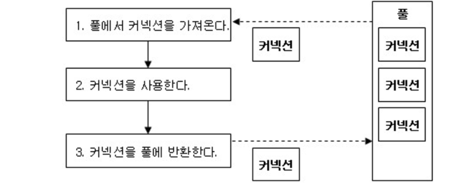

# 커넥션 풀 개념

커넥션 풀은 데이터베이스에서 제공하는 개념이 아니라, 애플리케이션 단에서 커넥션을 효율적으로 사용하기 위해 구현되는 기능이다. 

보통 스프링으로 개발을 할때 연결을 위해 데이터베이스 연결을 위해 JDBC, 커넥션 풀 관리를 위해 HikariCP 를 많이 사용한다.
- JDBC: Java 에서 데이터베이스와 상호작용하기 위한 표준 API 로, 데이터베이스와 연결하고 쿼리를 실행하며 결과를 처리하는 작업을 한다.
- HikariCP: 커넥션 풀 관리 라이브러리다. DataSource 설정에서 커넥션 풀을 구성하고 JDBC 커넥션을 효율적으로 관리한다.

MySQL과 같은 데이터베이스에서는 커넥션풀이 아니라, Connection 을 제어할 수 있다. 
- max_connections: 동시에 처리할 수 있는 최대 연결 수를 설정할 수 있다.

## 데이터베이스 커넥션 풀이란?

커넥션 풀이란 데이터베이스와의 연결(Connection)을 미리 여러 개 생성해 두고, 필요할 때마다 이를 재사용하는 기술이다. 
매번 데이터베이스 연결을 새로 생성하는 것은 시간과 자원을 많이 소모하기 때문이다.

애플리케이션과 데이터베이스 간의 연결은 네트워크를 통해 이루어지며, 이 과정에서 TCP/IP 핸드셰이크와 같은 여러 단계를 거쳐야 한다. 따라서 연결 설정에 상당한 시간을 소모하게 된다.
데이터베이스 커넥션 풀을 사용하면 미리 생성해 둔 연결을 재사용함으로써, 연결 생성에 소요되는 시간을 절약하고 애플리케이션의 성능을 향상시킬 수 있다.

## 커넥션 풀의 작동 원리

데이터베이스 커넥션 풀은 애플리케이션 서버가 시작될 때 일정 수의 데이터베이스 연결을 생성하고, 이를 풀에 저장해 두었다가 필요할 때마다 할당하고 반환하는 방식으로 작동한다.

1. 초기화: 애플리케이션 서버가 시작될 때 커넥션 풀이 초기화된다.
2. 연결 생성: 미리 설정된 수만큼의 데이터베이스 연결이 생성되어 풀에 저장된다.
3. 연결 할당: 클라이언트 요청이 들어오면 풀에서 사용 가능한 연결을 할당한다.
4. 연결 반환: 작업이 완료되면 연결은 풀로 반환되어 재사용된다.
5. 연결 관리: 풀은 연결의 유효성을 주기적으로 검사하고, 필요에 따라 연결을 갱신한다.

 