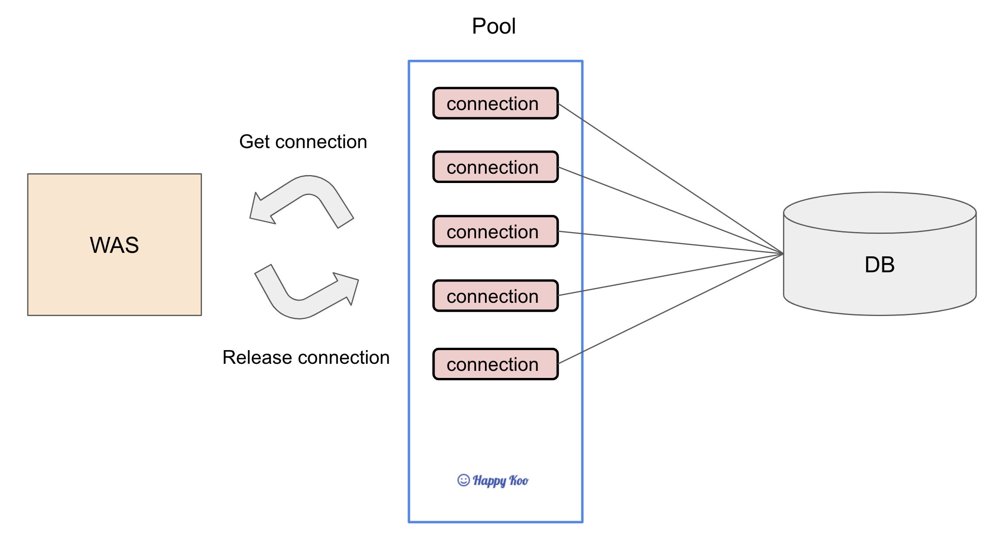

# 커넥션 풀 개념

## 커넥션 풀이란?

커넥션 풀이란 데이터베이스와의 연결(Connection)을 미리 여러 개 생성해 두고, 필요할 때마다 이를 재사용하는 기술이다. 

커넥션 풀은 데이터베이스에서 제공하는 개념이 아니라, 애플리케이션 단에서 커넥션을 효율적으로 사용하기 위해 구현되는 기능이다.

보통 스프링으로 개발을 할때 연결을 위해 데이터베이스 연결을 위해 JDBC, 커넥션 풀 관리를 위해 HikariCP 를 많이 사용한다.
- JDBC: Java 애플리케이션이 DB에 접속하기 위한 Java 표준 API로 데이터베이스와 연결하고 쿼리를 실행하며 결과를 처리하는 작업을 한다.
- HikariCP: 커넥션 풀 관리 라이브러리다. DataSource 설정에서 커넥션 풀을 구성하고 JDBC 커넥션을 효율적으로 관리한다.

MySQL과 같은 데이터베이스에서는 커넥션풀이 아니라, Connection 을 제어할 수 있다.
- max_connections: 동시에 처리할 수 있는 최대 연결 수를 설정할 수 있다.

## 커넥션 풀의 작동 원리

데이터베이스 커넥션 풀은 애플리케이션 서버가 시작될 때 일정 수의 데이터베이스 연결을 생성하고, 이를 풀에 저장해 두었다가 필요할 때마다 할당하고 반환하는 방식으로 작동한다.

1. 초기화: 애플리케이션 서버가 시작될 때 커넥션 풀이 초기화된다.
2. 연결 생성: 미리 설정된 수만큼의 데이터베이스 연결이 생성되어 풀에 저장된다.
3. 연결 할당: 클라이언트 요청이 들어오면 풀에서 사용 가능한 연결을 할당한다.
4. 연결 반환: 작업이 완료되면 연결은 풀로 반환되어 재사용된다.

커넥션 풀은 연결의 유효성을 주기적으로 검사하고, 필요에 따라 연결을 갱신하는 작업을 수행한다.

## 커넥션 풀을 왜 쓸까?

DB에 존재하는 데이터를 애플리케이션이 읽거나 쓰기 위해서는 다음 과정이 일어난다.
- 애플리케이션 서버는 DB 와 connection 을 맺는다. (connection 객체를 생성한다.)
- 쿼리를 실행해 데이터를 read 하거나 write 한다.
- connection 을 close 한다.

애플리케이션과 데이터베이스 간의 연결은 네트워크를 통해 이루어지기 떄문에 connection 을 맺고 끊는 작업은 다음의 단계를 거치게 된다.
- 데이터베이스와 TCP/IP 커넥션 연결 (TCP 3-way handshake 발생)
- username, password 등 데이터베이스 인증정보 검증
- 데이터베이스와 상호작용하기 위한 세션 생성
- 연결을 위한 커넥션 객체 생성

새로운 커넥션을 생성하고 닫는 작업은 서버 자원(CPU, 메모리, 네트워크)을 소모하며 시간이 걸리는 작업이다. 따라서 대규모 트래픽 환경에서 매번 Connection 을 생성하고 닫는다면 리소스 사용량이 급격하게 증가하고 성능이 느려질 수 있다.

이런 문제점을 해결하고자, 데이터베이스 커넥션풀을 사용해 DB와 일정 수의 connection 을 맺어 놓고, 이 connection 객체들을 pool에 저장해 놓고 재사용하는 것이다. 

 
### 커넥션 풀 사이즈

pool 에 최대로 저장되는 connection 수는 정해져 있다. connection 이 모두 사용중이라면 대기해야 하기 때문에 connection 사이즈를 너무 작게 설정하면 많은 요청이 발생할 경우 원활한 서비스가 이루어지지 않을 수 있다. 
그렇다고 connection 수를 매우 크게 잡는다면 connection 객체가 메모리를 많이 사용하기 때문에 오히려 성능을 떨어트릴 수 있다.

따라서 사용자 수에 따라 connection 수를 적절히 설정하는 것이 중요하다.

### 멀티스레드 환경에서 커넥션 풀을 사용할 때 

자바와 같이 멀티스레드 환경에서 thread 가 pool 에 저장되는 connection 수에 영향을 미치므로 주의해야 한다.

만약 하나의 스레드가 작업을 수행하는 데 여러 개의 connection이 필요하지만, 커넥션 풀에 사용 가능한 커넥션 수가 적다면 교착 상태(Dead lock)에 빠질 수 있다. 

커넥션 풀에는 최대 1개의 커넥션만 존재하고, 1개의 스레드가 있으며 하나의 작업에서 2개의 커넥션이 필요하다고 가정해보자.

스레드는 작업을 시작하면서 첫 번째 커넥션을 커넥션 풀에서 가져와 트랜잭션을 시작하고 첫 번째 쿼리를 실행하여 데이터를 처리한다. 이때 작업이 아직 완료되지 않았으므로, 현재 사용 중인 커넥션을 풀에 반납할 수 없다. (작업 도중 오류가 발생할 경우 롤백을 해야 하기 때문에 커넥션을 유지해야 한다.)

그러나 작업을 완료하려면 추가로 하나의 커넥션이 더 필요하다. 하지만 커넥션 풀에는 현재 사용 가능한 커넥션이 없기 때문에, 스레드는 풀에 커넥션이 반납되기를 기다리게 된다. 문제는 현재 커넥션을 반납할 수 있는 스레드가 동일한 작업을 수행 중이므로, 풀로 커넥션이 반환되지 않는다는 점이다. 

이로 인해 스레드는 커넥션이 반납될 때까지 무한히 기다리게 되고, 교착 상태(Dead lock)가 발생하게 된다. 결국, 커넥션을 기다리던 스레드는 타임아웃에 도달하여 작업을 완료하지 못하고 실패하기 때문에 트랜잭션은 롤백된다.

위와 같은 경우 때문에 스프링 부트에서 connection Pool 구현에 많이 사용하는 HikariCP에서는 Dead lock 상황을 피하기 위한 최소한의 connection 수를 제한해 두었다.

