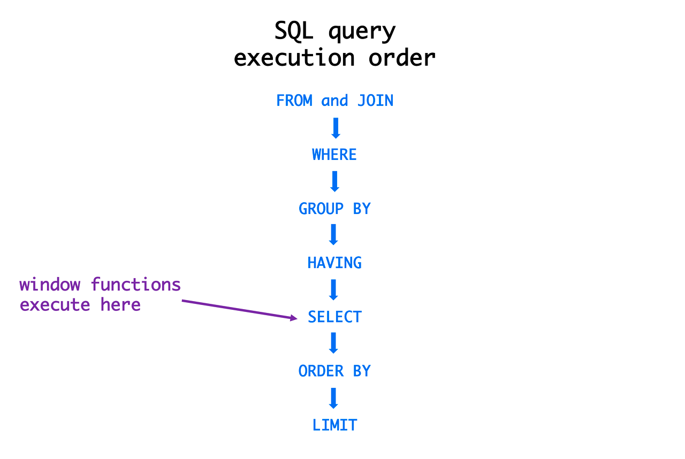

# SQL 기본 개념

## SQL 종류

### 데이터 객체 조작 (DDL)

테이블과 컬럼을 정의하는 명령어로 생성, 수정, 삭제 등의 데이터 전체 골격을 결정하는 역할을 담당한다.  
DDL은 명령어를 입력하는 순간 작업이 즉시 반영(Auto Commit)되기 때문에 사용할 때 주의해야 한다.

- `CREATE`:	테이블을 생성
- `ALTER` :	테이블의 구조를 수정
- `DROP`: 테이블을 삭제
- `RENAME`: 테이블을 이름을 변경
- `TRUNCATE` : 테이블을 초기화

 ALTER: 컬럼 변경 문법

| 명령어            | 내용            |
|-------------------|---------------|  
| `ADD COLUMN`      | 컬럼을 추가        |
| `DROP COLUMN`     | 컬럼을 삭제        |  
| `MODIFY COLUMN`   | 컬럼을 수정        |  
| `RENAME COLUMN`   | 컬럼 이름을 변경     |  
| `DROP CONSTRAINT` | 컬럼의 제약 조건을 삭제 |

### 데이터 권한 조작 (DCL: Date Control Language)

데이터를 관리 목적으로 보안, 무결성, 회복, 병행 제어 등을 정의하는데 사용한다. DCL을 사용하면 데이터베이스에 접근하여 읽거나 쓰는 것을 제한할 수 있는 권한을 부여하거나 박탈할 수 있다.

- `GRANT`: 권한을 정의
- `REVOKE`: 권한을 삭제

### 데이터 조작 (DML)

주로 데이터를 삽입, 수정, 삭제, 조회하는 작업에 사용된다. DML 명령어는 데이터 자체를 변경하지만, 데이터베이스 구조에는 영향을 주지 않는다.

- `INSERT`: 데이터를 삽입
- `UPDATE`: 기존 데이터를 수정
- `DELETE`: 데이터를 삭제

### 트랜잭션 조작 (TCL: Transaction Control Language)

데이터베이스에서 트랜잭션을 제어하는 명령어 집합이다. 

- `COMMIT`: 트랜잭션에서 수행된 변경사항을 확정
- `ROLLBACK`: 트랜잭션 중 오류가 발생했을 때 모든 변경사항을 취소하고 이전 상태로 복구
- `SAVEPOINT`: 트랜잭션 내에서 특정 지점을 설정해, 필요시 그 지점으로 롤백

### 데이터 질의 (DQL: Data Query Language)

- `SELECT`: 데이터 조회

## SQL 기본 문법

### SELECT

테이블에서 데이터를 조회하는 기본 구문이다.
```sql
SELECT name, age FROM users;
```
- `name`과 `age` 컬럼을 `users` 테이블에서 조회한다.

### FROM

데이터를 조회할 테이블을 지정한다.
```sql
SELECT * FROM products;
```
- `products` 테이블에서 모든 컬럼을 조회한다.

### WHERE

조건에 맞는 데이터를 필터링할 때 사용한다.
```sql
SELECT * FROM employees WHERE age > 30;
```
- 나이가 30보다 큰 직원만 조회한다.

### ORDER BY

결과를 정렬할 때 사용하는 구문이다.   
기본적으로 오름차순(ASC), 또는 내림차순(DESC)으로 데이터를 정렬할 수 있다.

```sql
SELECT * FROM employees ORDER BY name ASC;
```
- `name` 컬럼을 기준으로 오름차순 정렬한다.

### AGGREGATE

집계 함수로 데이터를 요약할 때 사용한다. 대표적인 집계 함수로는 `COUNT`, `SUM`, `AVG`, `MIN`, `MAX`가 있다.

```sql
SELECT COUNT(*) FROM employees;
```
- `employees` 테이블의 총 레코드를 카운트한다.

### GROUP BY

데이터를 특정 기준으로 그룹화하여 요약하는 구문이다.   

아래 예시에서는 부서별로 그룹핑해 각 부서에 속한 직원 수를 계산할 때 사용했다.
```sql
SELECT department, COUNT(*) FROM employees GROUP BY department;
```
- 부서별로 직원 수를 그룹핑하여 조회한다.

### LIMIT

조회 결과의 행 수를 제한해 원하는 수 만큼 데이터를 출력할 수 있다.
```sql
SELECT * FROM employees LIMIT 5;
```
- 상위 5개의 레코드만 조회한다.

###  INNER JOIN
두 테이블 모두에 일치하는 데이터를 조회한다.
```sql
SELECT employees.name, departments.name FROM employees 
INNER JOIN departments ON employees.department_id = departments.id;
```
- 직원과 부서가 일치하는 행만 조회한다.

### LEFT JOIN

**왼쪽 테이블을 기준**으로 조인을 하여 오른쪽 테이블에 대응되는 값이 없으면 `NULL`을 반환한다.
```sql
SELECT employees.name, departments.name FROM employees 
LEFT JOIN departments ON employees.department_id = departments.id;
```
- 모든 직원과 그들의 부서를 조회하며, 부서 정보가 없으면 `NULL`로 표시된다.

### LIKE
패턴 매칭을 통해 데이터를 조회한다.
```sql
SELECT * FROM employees WHERE name LIKE 'J%';
```
- 이름이 'J'로 시작하는 모든 직원을 조회한다.

### IN
여러 값 중 하나와 일치하는 데이터를 조회한다.
```sql
SELECT * FROM employees WHERE department_id IN (1, 2, 3);
```
- `department_id`가 1, 2, 3 중 하나인 직원을 조회한다.

### CASE WHEN

조건문을 사용하여 데이터를 변환한다. 복잡한 조건문을 처리할 때 유용하다
```sql
SELECT name, 
CASE WHEN age < 30 THEN 'Young' ELSE 'Old' END as Age_Group
FROM employees;
```
- 나이에 따라 직원의 나이 그룹을 분류한다.

### HAVING

`GROUP BY`의 결과에 조건을 적용할 때 사용한다.
```sql
SELECT department, COUNT(*) FROM employees 
GROUP BY department HAVING COUNT(*) > 5;
```

- 5명 이상의 직원을 가진 부서만 조회한다.

### UNION ALL

두 개 이상의 SELECT 결과를 결합할 때 사용된다. 중복된 데이터를 제거하지 않고 그대로 반환한다.

```sql
SELECT name FROM employees 
UNION ALL
SELECT name FROM managers;
```
- 직원과 매니저의 이름을 모두 조회한다.

### SUBQUERY

하위 쿼리로 다른 쿼리에서의 결과를 사용한다.
```sql
SELECT * FROM employees WHERE department_id = 
(SELECT id FROM departments WHERE name = 'Sales');
```

- 'Sales' 부서에 속한 직원을 조회한다.

### CTE (WITH)

공통 테이블 표현식(Common Table Expression)은 임시 결과 집합을 저장하고 재사용할 수 있게 한다. 
복잡한 쿼리를 간결하게 표현할 때 유용하다.  

```sql
WITH SalesEmployees AS (
    SELECT * FROM employees WHERE department_id = 
    (SELECT id FROM departments WHERE name = 'Sales')
)
SELECT * FROM SalesEmployees;
```
- 'Sales' 부서의 직원을 임시 테이블로 저장하고 그 결과를 조회한다.

### STORED PROCEDURE

미리 작성된 SQL 코드의 집합을 서버에 저장하고 필요할 때마다 호출해 실행할 수 있다.

```sql
DELIMITER //
CREATE PROCEDURE GetEmployee(IN emp_id INT)
BEGIN
    SELECT * FROM employees WHERE id = emp_id;
END //
DELIMITER ;
```
- 특정 직원의 정보를 조회하는 저장 프로시저를 만든다.

DELIMITER: MySQL에서 기본 구분자는 세미콜론(;)이지만, 프로시저 내부에서는 여러 구문을 처리하므로 구분자를 임시로 `//`로 변경한다.  
CREATE PROCEDURE: GetEmployee라는 프로시저를 생성한다.  
IN: 입력 매개변수로 emp_id를 받는다.  
END 후 다시 구분자를 세미콜론으로 복구한다.  

### TRIGGER

트리거는 데이터베이스 내에서 특정 이벤트가 발생할 때 자동으로 실행되는 SQL 코드다. 주로 데이터 변경 시 추가 작업을 수행할 때 사용된다.

```sql
CREATE TRIGGER after_insert_employee 
AFTER INSERT ON employees 
FOR EACH ROW 
INSERT INTO logs(action) VALUES('New employee added');
```
- 새 직원이 추가되면 로그에 기록하는 트리거를 생성한다.

### WINDOW FUNCTION

윈도우 함수는 데이터를 여러 행을 기준으로 계산하는데 사용된다. OVER 절을 통해 특정 구간에서 데이터를 처리한다.

```sql
SELECT name, department_id, 
RANK() OVER (PARTITION BY department_id ORDER BY salary DESC) as rank
FROM employees;
```
- 부서별로 직원의 급여 순위를 계산한다.

## SQL 실행 순서

쿼리 작성 순서와, 작성한 쿼리가 실행되는 순서는 다르다.
일반적인 SQL 실행 순서는 아래와 같으며, 세부적으로는 DBMS 마다 다르다.



1. FROM: 데이터를 조회할 테이블을 지정
2. JOIN: 테이블을 결합하여 결과를 생성
3. WHERE: 조건에 맞는 데이터를 필터링
4. GROUP BY: 데이터를 특정 기준으로 그룹화
5. WITH ROLLUP: 그룹화된 데이터에 총합 또는 누적 값을 추가. 
6. HAVING: 그룹화된 데이터에 조건을 적용 
7. SELECT: 최종적으로 선택된 컬럼을 반환 
8. DISTINCT: 중복된 행을 제거 
9. ORDER BY: 결과를 정렬 
10. LIMIT/OFFSET: 결과를 제한하거나 오프셋을 지정

실행 순서는 크게 3개로 분할해 생각해볼 수 있다.

- FROM
- JOIN-WHERE-GROUP BY-HAVING
- SELECT-DISTINCT-ORDER BY-LIMIT


 
