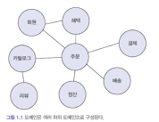
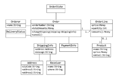
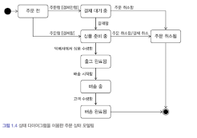
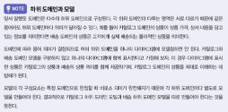
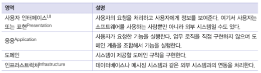
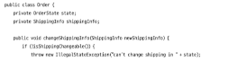
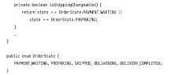

# 1장
## 1.1 도메인이란?

도메인(domain)은 **소프트웨어로 해결하고자 하는 문제영역**을 의미한다.

ex) 온라인 서점은 상품조회, 구매, 결제, 배송추적 등 기능을 제공해야 한다.

→ 이때 온라인 서점은 소프트웨어로 해결하고자 하는 문제영역이므로 도메인에 해당한다.

한 도메인은 하위 도메인으로 나눌 수 있다.

온라인 서점 도메인의 경우 아래처럼 하위도메인들로 나눌 수 있다.

- ex) 혜택: 쿠폰, 특별할인 처리 / 배송: 고객에게 구매한 상품을 전달하는 과정 처리

한 하위 도메인은 다른 하위도메인과 연동해 완전한 기능을 제공한다.
- ex) 고객이 물건을 구매하면 주문, 결제, 배송, 혜택 등 여러 도메인의 기능이 엮임

특정 도메인을 위한 소프트웨어라고 해서 도메인이 제공해야 할 모든 기능을 직접 구현하지는 않는다.
- ex) 자체적으로 배송 시스템을 구축하지 않고 외부 배송업체의 시스템을 사용하고 배송 추적 정보를 제공하는 데 필요한 기능만 일부 연동

## 1.3 도메인 모델

도메인 모델은 특정 도메인을 개념적으로 표현한 것이다.

### 클래스 다이어그램

도메인을 이해하려면 도메인이 제공하는 기능과 도메인의 주요 데이터 구성을 파악해야 하는데, 이런 면에서 기능과 데이터를 함께 보여주는 객체 모델은 도메인을 모델링하기 적합하다.

주문모델을 클래스 다이어그램으로 대략적으로 구성한 그림 (도메인의 모든 내용을 담고 있지는 않음)

- 주문을 하려면 상품을 몇개 살지 선택하고 배송지를 입력
- 선택한 상품 가격을 이용해 총 지불 금액을 계산하고 금액 지불을 위한 결제수단 선택
- 주문한 뒤에도 배송 전이면 배송지 주소를 변경하거나 주문을 취소할 수 있음
   - changeShipping()
   - cancel()

> ### 다이어그램에서 클래스 간 관계의 일반적 해석 방법
> #### 선과 다중성(Multiplicity)
> 선 위의 숫자는 관계의 다중성을 나타냄
> - 1: 반드시 하나만 존재
> - 0..1: 0개 또는 1개 (존재하지 않을 수도 있음)
> - 1..*: 최소 1개 이상
> - *: 0개 이상의 다수
> 
> #### 화살표
> 단순 선: 양방향 관계 (연관 관계)
> 화살표: 단방향 관계 (한쪽에서만 참조)
> 다이아몬드(흰색 또는 검은색): 집합성 또는 구성 관계를 나타냄
> 
> #### 클래스의 속성과 메서드
> - 속성: 객체의 데이터를 저장
> - 메서드: 객체의 동작(비즈니스 로직)
> 
> ex) 예시  
> OrderLine와 Product (1 - 0..1)
> - OrderLine은 하나의 Product와 연결될 수 있지만, Product는 반드시 존재하지 않을 수도 있음 (0..1)
> - Product 는 반드시 하나의 OrderLine 에 종속 (빈 주문은 존재할 수 없음)
> 
> Order와 OrderLine (1 - 1..*)
> - Order는 최소 하나 이상의 OrderLine을 포함.
> - OrderLine은 반드시 하나의 Order에 종속.

### 상태 다이어그램

상태 다이어그램을 통해 주문의 상태 전이를 모델링할 수 있다.

- 상품 준비중 상태에서 주문을 취소하면 결제취소가 함께 이루어짐을 알 수 있음

## 1.4 도메인 모델 패턴

아키텍처 상의 "도메인 계층"을 객체지향 기법으로 구현하는 패턴

도메인의 핵심 규칙을 구현한 코드가 도메인 계층에 위치
-> 도메인 규칙을 객체지향 기법으로 구현하는 패턴이 도메인 모델 패턴

OrderState 는 Order 에 속한 데이터이므로 배송지 정보 변경 가능 여부를 판단하는 코드를 Order 로 이동

 
배송지 변경이 가능한지 판단할 규칙이 주문 상태와 다른 정보를 함께 사용한다면 OrderState enum 에서 배송지 변경 여부를 판단할 수 없다.

핵심은 주문과 관련된 중요 업무 규칙을 주문 도메인 모델인 Order 나 OrderState 에서 구현한다는 것
- 핵심 규칙을 구현한 코드는 도메인 모델에만 위치하기 때문에 규칙이 바뀌거나 규칙을 확장해야 할 때 다른 코드에 영향을 덜 주고 변경 내역을 모델에 반영할 수 있음

> ### "도메인 모델" 용어
> - 도메인 자체를 표현하는 개념적인 모델을 의미
> - 도메인 계층을 구현할 때 사용하는 **객체 모델을 언급할때도** 사용 ex) Order, OrderState

> ### 개념 모델과 구현 모델
> 개념모델: 순수하게 문제를 분석한 결과물로 실제 코드를 작성할 때 개념 모델을 있는 그대로 사용할 수 없음 (데이터베이스, 트랜잭션 처리, 성능, 구현기술 등 고려하지 않는 개념적 모델)
> 구현모델: 개념모델을 구현 가능한 형태로 전환한 것
> 
> 처음부터 완벽한 개념모델을 만들기보다 전반적인 개요를 알 수 있는 수준으로 작성
> 프로젝트 초기에는 개요 수준의 개념 모델로 도메인에 대한 전체 윤곽을 이해하는데 집중하고, 구현하는 과정에서 점진적으로 구현모델로 발전시켜나가야 함

### 엔티티

엔티티는 식별자를 가진다. 엔티티를 생성하고, 속성을 바꾸고, 삭제할 때까지 식별자는 유지된다. 엔티티의 식별자는 바뀌지 않고 고유하기 때문에 두 엔티티객체의 식별자가 같으면 두 엔티티는 같다고 판단한다.

- UUID

일련번호를 식별자로 사용하기도 한다. 자동 증가 컬럼은 DB 테이블에 데이터를 삽입해야 값을 알 수 있기 때문에 테이블에 데이터를 추가하기 전에는 식별자를 알 수 없다

- 엔티티 객체를 생성할 때 식별자를 전달할 수 없다.

자동 증가 컬럼을 사용할 경우 리포지토리는 DB 가 생성한 식별자를 구해서 엔티티 객체에 반영한다.

### VO 는 불변객체여야 한다.

 
VO 가 불변객체여야 하는 이유

- Money 가 setValue() 와 같은 메서드를 제공해 값을 변경할 수 있다면 OrderLine 의 price 값이 잘못 반영되는 상황이 발생할 수 있다.

불면객체는 참조 투명성과 스레드에 안전한 특징을 가지고 있기 때문

VO 에는 set 메서드를 구현하지 않는다.

### 도메인 모델에 set 메서드 넣지 않는다.

setXX(): 단순히 값을 설정한다는 것을 의미

1. 단순히 상태값만 변경할지, 아니면 상태값에 따라 다른 처리를 위한 코드를 함께 구현할지 애매하다. 상태 변경과 관련된 도메인 지식이 코드에서 사라지게 된다.
2. 도메인 객체를 생성할 때 온전하지 않은 상태가 될 수 있다.

   

   도메인 객체가 불완전한 상태로 사용되는 것을 막으려면 생성자를 통해 필요한 데이터를 모두 받아야 한다.

   생성자로 필요한 것을 모두 받으므로, 생성자를 호출하는 시점에 필요한 데이터가 올바른지 검사한다.

   

   클래스 내부에서 데이터를 변경할 목적으로만 set 메서드를 사용한다. 접근 범위가 private인 set 메서드를 이용해 외부에서 데이터를 변경할 목적으로 사용하지 못하도록 한다.