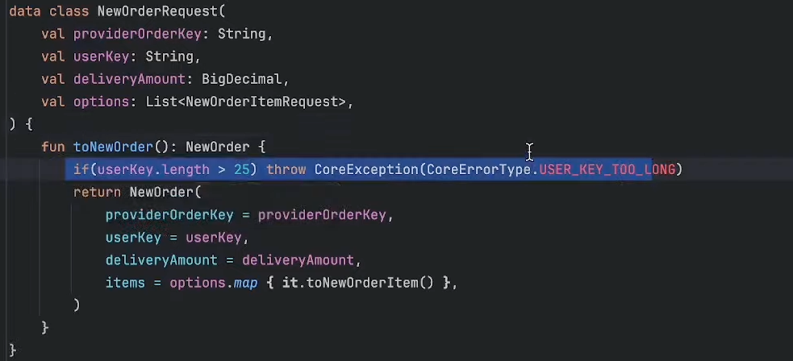

## 레이어별 검증 전략

각 계층 dto 마다 어떻게 validate 해야 하는지
- 어느계층에서 어디까지 validate 하는지

[답변]

api 스펙자체는 넘어왔을때 비즈니스객체로 세팅한다.

null 은 도메인계층에 넘기지 않는다. 프레젠테이션 계층에서 거른다.

프레젠테이션 계층에서는 api 스펙에대한 검증 
- blank, null 검증
- 길이 검증 등 api 스펙에 대한 검증 (ex key 의 길이는 25자리 미만이어야 한다)

프레젠테이션레이어에서 비즈니스레이어로 넘어갈때 가급적 검증을 많이 해두고 뒤에서는 검증코드를 많이 넣지 않으려고 하는 편

그래도 검증이 필요하다면, 비즈니스 레이어보다 implement 레이어에서 

dto 에 데이터를 넣을때 잘넣었으면 꺼낼때 (읽을때) 검증 X  

- 개인적으로 @Valid 방식 (@Min, @Max 이런것) 보다 명시적으로 예외를 던져주는게 테스트하기 편해서 선호하는 편
 
