## 모듈 분리 시 의존관계 설정

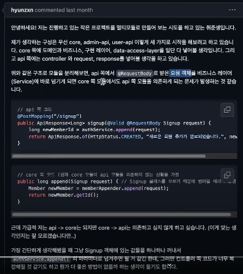

core, admin-api, user-api 로 나눈 상태

core 쪽에 도메인, 비즈니스레이어, implement 레이어, data-access-layer 다 넣음
api 쪽에 controller 와 request, response

[문제 상황] 
1. api 쪽에서 @RequestBody 로 받은 요청 객체를 비즈니스레이어 (service) dp 바로 넘기게 되면 core 쪽 모듈에서 api 모듈을 의존하게 되는 문제가 발생
2. Signup request 객체에 있는 값들을 하나하나 꺼내서 AuthService 의 파라미터로 넘겨주면 될 것 같은데
컨트롤러쪽 코드가 너무 복잡해질 것 같고, 더 좋은방법은 없을지
- 예시 코드에서 provider 파라미터를 메서드에 공통적으로 넣었는데, Provider 클래스가 어떤 역할을 하는지?

[답변]

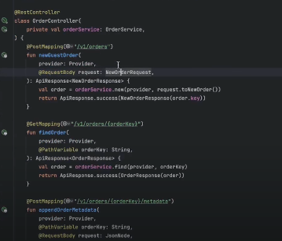

컨트롤러에서 @RequestBody 로 NewOrderRequest 를 받음

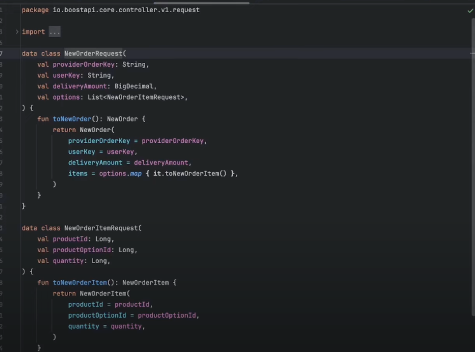

api 모듈에 NewOrderRequest 가 존재

비즈니스를 처리하는 쪽에 request.toNewOrder() 로 도메인 개념객체로 변환해서 전달한다.
- api -> core-domain (의존관계 O)
- api <-> core-domain (양방향 의존 X)

[예시2]

request 를 받은 것과 도메인 객체와 1대 1이면 굳이 받을 필요가 있는가?

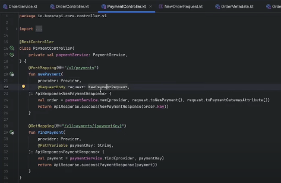

PaymentController 가 있을 때

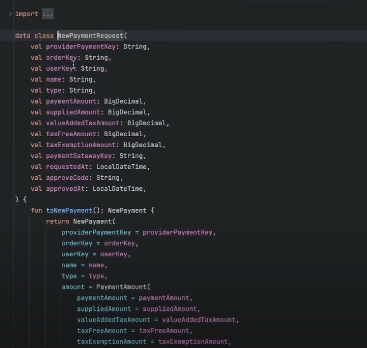

결제를 하는 NewPaymentRequest (api 모듈)

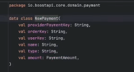
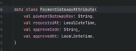

NewPayment (domain 모듈)
PaymentGatewayAttribute (domain 모듈) 

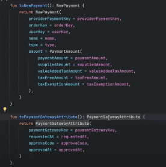

도메인객체로 변환해줄때
NewPayment 와 PaymentGatewayAttribute 로 변환

외부 요청에 대한 객체와 핵심적으로 다뤄야 하는 비즈니스에 맞는 중요한 객체들로 변환해서 내려준다.

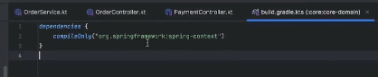

domain 에는 의존성이 필요가 없고 (spring-context 만 가짐)

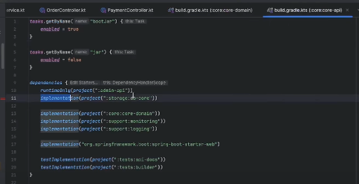

api 모듈에서 core-domain 을 implement 해주면 core-domain 은 api 를 알 필요가 없게 구성할 수 있음

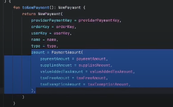
도메인에서 중요한 객체는 별도 객첵로 묶어서 분리할 수 있다.
- ex) 금액에 대한 부분은 PaymentAmount 객체로 묶어서 넘겨준다. (중요한 객체의 재사용성을 늘린다)

[요약]
외부 api 스펙에 맞춰 Presentation Layer 를 관리하고, 실제 비즈니스에서 중요하게 생각하는 개념들은 도메인영역에서 객체로 만들어 변환해서 넘겨준다.