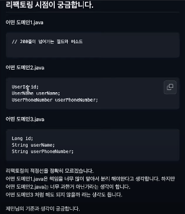

## 웹&앱 서비스 시 백엔드 처리 전략 + 예외 메세지 처리 + 도메인 리펙토링 기준

### 1.백엔드에서 처리해야하는 로직, 프론트엔드에서 처리해야하는 로직

클라이언트: ios, aos, pc

다음 3가지를 고려해서 백엔드에서 할지 말지 판단한다.

1. 얼마나 중요한 로직인가
    - 노출을 위한 로직이면 -> 클라이언트가
    - 값 자체가 의미가 있거나 가치가 있다면 -> 백엔드가

2. 변경 가능성이 얼마나 되는가
    - 퍼센트 로직에서 추가 로직이 생긴다면 클라이언트 세군데에서 모두 변경해야 함
      -> 변경 가능성이 높다면 백엔드에서 처리 => presentation layer 역할

3. 하위 호환성 정책이 어떻게 되는가?

   웹 -> 같이 배포  
   앱 -> 구버전 앱, 신버전 앱

   구버전앱은 personTotalSize, sickPersonCount 2가지 변수를 사용하는 상태,
   신버전에는 새로운 데이터를 추가하는 등 변경이 일어남

   구버전앱 버전을 어디까지 유지하는지?
   -> 정책 관련 문제 = 회사나 팀의 하위호환성 전략이 어떤가?
    - 앱 버전 올릴때마다 이전 버전을 강제 업데이트 시키겠다 => 프론트엔드에서 새로운 로직을 처리하도록 설계해도 괜찮다.
    - 구버전 앱도 오래 유지한다 => 백엔드에서 처리해주면 좋다.

   백엔드가 데이터를 구버전과 신버전에 맞게 변환하면, 구버전 앱의 사용자도 앱 업데이트 없이 계속 사용 가능

[예시1]
- 에러메시지를 클라이언트에 하드코딩 -> 서버는 에러코드만 내려줌 ex) E100 / E205
- 문제점: 에러메시지를 바꿔줘야 하는데 앱은 배포가 되었기 때문에 에러메시지를 바꿀 수 없음

[예시2]
- 어떤 UI 에서 보여주는 텍스트를 변경해야 할 때
    - ex) title: 안녕하세요! -> 감사합니다!
- 문제점: 구버전앱에 하드코딩이면 버전을 올려야 변경 가능

*참고 - 앱을 킬 때 에러메시지 맵을 매번 받거나, 메모리나 스토리지에 올려놓는 경우도 있고, 백엔드가 항상 에러텍스트 줘서 앱은 그대로 노출하는 경우도 있음

### 2.예외처리에 대해

답변
- 도메인이 가지고 있는 에러타입과 API 가 가지고 있는 에러를 별도로 구성해놓음
- 도메인 영역에서 나온 메시지를 ExceptionHandler 로 잡아서 전달하고 있긴 하다.

도메인 메시지가 나왔을때 서비스적으로 부자연스럽다면 매핑을 해주고 아니라면 그대로 이용
도메인에서 에러메시지 안만들고 코드만 만들고, 프레젠테이션 영역에서 매시지 만들 수도 있다. (필요에 의해)

분리 예시

[api 에러 타입]

[domain 에러 타입]

### 3.도메인 리팩토링 기준

케이스마다 다르고 정해진게 없다.
이 도메인이 응집이 지금 수준에서 내가 다루고자 하는 것에서 올바른가?
- 2번의 경우 user 하위 개념들을 만들어서 다루고 있는데 이게 과연 필요한가? (너무 과한 것 아닌가?)
- ex) UserId 가 과연 필요한가? Long 을 사용하면 안되는지?

만약 필드가 너무 많다고 생각되면 별도로 분리를 하는 것을 고려할 수 있다.
기본적으로 3번으로 가다가 1번처럼 너무 많아진다 싶으면 자연스럽게 별도 객체로 만들어 응집시켜 놓을 수 있다.

현재 sw 에서 다루는 개념을 생각해서 정립해야 한다. -> 도메인에 대한 이해가 필수

ex) 유저 - 리뷰 - 상품 - 주문 로 되어있다면

// 1차 중요 개념들
유저 - 리뷰의 관계
관계는 1:n 이다

UserName 이라는 개념이 중요한 개념에 포함된다면 응집시킨다.

// 2차 하위개념
유저
유저 개인정보 - 이름, 폰번, 주소 ...

부수적인 부분이라면 굳이 별도로 만들지 않아도 됨

[정리]
1. 필드가 너무 많아서 분리해야 할 것 같다면 분리
2. 분리해 놓을 필드가 도메인에서 중요 개념에 포함된다면 분리

