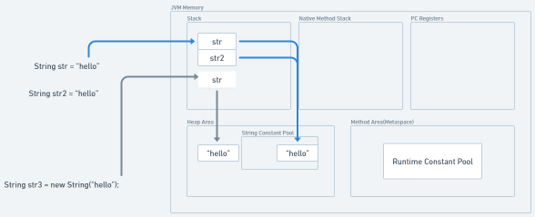
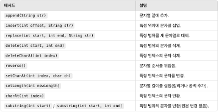

# 문자열(String)

## String literal, new String("")

String literal
- "Hello"처럼 선언된 문자열은 String Pool에 저장되고, 동일 문자열은 재사용
new String("")
- 항상 Heap 메모리에 새로운 객체를 생성
- 동일한 문자열이라도 Pool의 객체를 재사용하지 않음

일반적으로 String Pool을 활용하는 String literal 방식이 더 효율적이다.

```java
String str1 = "Hello";               // String Pool에 저장
String str2 = new String("Hello");   // Heap에 새로운 객체 생성

System.out.println(str1 == str2);    // false (다른 객체)
System.out.println(str1.equals(str2)); // true (내용은 동일)
```
## String, StringBuilder, StringBuffer

### String
- 불변 객체(Immutable)
- 한 번 생성된 문자열은 변경할 수 없기 때문에 문자열 변경 시, 새로운 문자열 객체를 생성해야함
- Thread-Safe (동기화가 필요 없음)
- String Constant Pool을 통해 메모리를  효율적 관리할 수 있음
- 문자열 변경 작업이 많은 경우, 객체가 많이 생성되어 메모리 낭비가 발생할 수 있음.



Java에서 문자열 리터럴을 저장하는 독립된 영역을 `String Constant Pool` 또는 `String Pool`이라고 부른다.
String은 불변객체이기 때문에 문자열의 생성 시 이 String Constant Pool에 저장된 리터럴을 재사용해 메모리를 효율적으로 사용할 수 있다.

Java 7부터 String Constant Pool은 힙(Heap) 영역에 존재한다.
이전(Java 6 및 그 이전 버전)에는 Method Area(클래스 메타데이터가 저장되는 영역)에 존재했으나, Java 7 이후 메모리 관리 최적화를 위해 힙 영역으로 이동했다.


### StringBuilder 
- 가변 객체(Mutable)
- 문자열 변경이 가능하며 메서드를 호출하면 원본 객체 자체가 변경
- 동기화가 지원되지 않으므로(Thread-Unsafe ) 다중 스레드 환경에서 안전하지 않음
- 문자열 변경 작업이 많을 때 String보다 빠름


 
### StringBuffer
- 가변 객체(Mutable)
- StringBuilder와 유사하지만, 동기화를 지원 (Thread-Safe)
- 다중 스레드 환경에서 안전
- 단일 스레드 환경에서는 StringBuilder보다 느리지만, 다중 스레드 환경에서 적합

```java
public class StringPerformance {
    public static void main(String[] args) {
        long startTime, endTime;

        // String
        String str = "";
        startTime = System.currentTimeMillis();
        for (int i = 0; i < 1000000; i++) {
            str += "a"; // 새로운 객체 계속 생성
        }
        endTime = System.currentTimeMillis();
        System.out.println("String Time: " + (endTime - startTime));

        // StringBuilder
        StringBuilder sb = new StringBuilder();
        startTime = System.currentTimeMillis();
        for (int i = 0; i < 1000000; i++) {
            sb.append("a");
        }
        endTime = System.currentTimeMillis();
        System.out.println("StringBuilder Time: " + (endTime - startTime));

        // StringBuffer
        StringBuffer sbf = new StringBuffer();
        startTime = System.currentTimeMillis();
        for (int i = 0; i < 1000000; i++) {
            sbf.append("a");
        }
        endTime = System.currentTimeMillis();
        System.out.println("StringBuffer Time: " + (endTime - startTime));
    }
}
```
String, StringBuilder, StringBuffer 실행 시간 측정 결과 

- String은 객체를 매번 생성하므로 가장 느리게 동작한다.

100000000 으로 증가시키고 StringBuilder 와 StringBuffer 를 비교한 결과


- StringBuffer는 모든 메서드가 synchronized로 구현되어 있어, 매번 동기화 작업이 수행된다. 
- 동기화 작업은 락을 획득하고 해제하는 비용이 발생하며, 반복 작업이 많아질수록 성능차이가 드러난다.