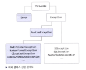

# 예외

## 예외의 종류

- 에러(Error)
- 체크 예외 (Checked Exception)
- 언체크 예외 (Unchecked Exception)

자바 프로그램에 오류가 발생했을 때, 오류의 이름이 Error 로 끝나면 에러고 Exception 으로 끝나면 예외다.



- Checked 예외: Exception 을 바로 확장한 클래스들
- Unchecked 예외: RuntimeException 밑에 확장되어 있는 클래스들 (=런타임 예외들)

## Error

Error는 JVM이나 시스템 관련 문제가 발생하며, 애플리케이션 전체(프로세스)에 영향을 미친다.
- 주로 자바 프로그램 밖에서 발생한 예외   
   ex) 메모리부족, 서버의 디스크 고장, 메인보드 고장 등으로 자바 프로그램이 제대로 동작하지 못하는 경우
주로 JVM 에서 발생시키기 때문에, 잡아서 대응할 수 있는 방법이 없음 (=복구불가능)

## Exception

java.lang.Exception 클래스와 하위 클래스들이다. Exception 은 애플리케이션 코드에서 발생하며, 개별 스레드에만 영향을 미친다.
Checked Exception 과 Unchecked Exception 으로 구분된다.

## Checked Exception

체크 예외는 개발자가 실수로 예외 처리를 누락하지 않도록 컴파일러가 도와준다. 하지만 개발자가 모든 체크 예외를 처리해주어야 하므로 번거로우며, 신경쓰지 않고 싶은 예외까지 처리해야 한다는 단점이 있다.
실제로 애플리케이션 개발에서 발생하는 예외들은 복구 불가능한 경우가 많다. 예를 들어, SQLExceptoin과 같은 체크 예외를 catch해도, 쿼리를 수정하여 재배포하지 않는 이상 복구되지 않는다. 그래서 실제 개발에서는 대부분 언체크 예외를 사용한다.

## Unchecked Exception(=Runtime Exception)
예외를 try-catch 로 묶지 않아도 컴파일할 때 예외가 발생하지 않지만, 실행시 발생할 가능성이 있다.
- 실행시에 발생할 가능성이 있기 때문에 런타임 예외라 함
- 컴파일시에 체크하지 않기 때문에 unchecked exception 이라고도 부름

ex) NullPointerException이나 IllegalArgumentException 등

## Throwable 클래스

Error 와 Exception 클래스는 Throwable 클래스를 상속받아 처리하도록 되어 있다. 이렇게 만든 이유는 Exception 이나 Error 의 성격은 다르지만 모두 동일한 이름의 메서드를 사용해 처리할 수 있도록 하기 위함이다.

Throwable 생성자를 보면, 예외 메시지를 String 으로 넘겨주고, 별도 예외 원인을 Throwable 객체로 넘겨줄 수 있다.
- Throwable()
- Throwable(String message)
- Throwable(String message, Throwable cause)
- Throwable(Throwable cause)

Trowable 클래스에 선언되어 있고, Exception 클래스에서 Overriding 한 대표적인 메서드
- getMessage()
  - 예외 메시지를 String 형태로 제공
  - 어떤 예외가 발생되었는지 확인용
  - 주로 별도 예외메시지를 만들어서 사용하에게 보여주려고 할 때 사용
- toString()
  - 예외 메시지를 String 형테로 제공하는데 getMessage() 메서드보다 더 자세하게 예외 클래스 이름도 같이 제공
- printStackTrace()
  - 첫 줄에 예외 메시지를 출력하고, 둘째줄부터 예외가 발생하게 된 메서드들의 호출관계 (스택 트레이스) 출력
  - 운영 시스템에 사용하면 로그양이 방대해지므로, 개발할때만 사용하는 것이 좋음

예외를 직접 만들때는 Throwable 의 자손클래스들을 상속받아 만들어야 한다.

## throw 와 throws

throw 
- 예외를 직접 발생시키는 키워드
- 예외를 생성하고 발생시키는 로직은 메서드 내부에 위치
- 예외가 발생하면, 프로그램은 해당 지점에서 실행을 멈추고 예외를 처리할 수 있는 가장 가까운 catch 블록으로 이동

cach 블록 중에 throw 한 예외와 동일하거나 상속 관계에 있는 예외가 있다면 그 블록에서 예외를 처리할 수 있다.
만약 해당하는 예외가 없다면, 발생된 예외는 호출한 메소드로 던지는데, 이때 throws 를 사용한다.

throws
- 메서드가 특정 예외를 던질 가능성이 있음을 선언하는 키워드
- 메서드 선언부에 메서드가 **체크 예외(Checked Exception)**를 던질 수 있음을 명시
- throws 로 예외를 선언하면 해당 메서드에서 선언한 예외가 발생했을 때 호출한 메서드로 예외가 전달
- 두 가지 이상의 예외를 던질 수 있다면 implement 처럼 콤마로 구분해서 예외 클래스 이름을 적어줌 

throws 로 메소드를 선언한 메서드를 호출하는 부분에서는 try-catch 로 감싸서 처리하거나, 다시 throws 할 수 있다.  

throws는 IOException, SQLException과 같은 **체크 예외**를 선언한다.  
런타임 예외(RuntimeException)는 선언하지 않아도 된다.
- 런타임 예외는 프로그램 실행 중 예상치 못한 상황(버그나 논리적 오류)에서 발생하는 예외이므로, 컴파일러가 강제적으로 처리하지 않도록 설계되었기 때문

```java
public class ExceptionExample {

   // throws: 메서드가 IOException을 던질 수 있음을 선언
   public void readFile(String fileName) throws IOException {
      if (fileName == null) {
         throw new IOException("File name cannot be null"); // throw: 예외 발생
      }
      System.out.println("Reading file: " + fileName);
   }

   public static void main(String[] args) {
      ExceptionExample example = new ExceptionExample();
      try {
         example.readFile(null); // 메서드 호출
      } catch (IOException e) {
         System.out.println("Caught exception: " + e.getMessage());
      }
   }
}
```

## 예외 처리 전략 

1. 임의의 예외 클래스를 만들때 반드시 try-catch 로 묶어 줄 필요가 있을 경우에만 Exception 클래스를 확장한다.
2. 일반적으로 실행 시 예외를 처리할 수 있는 경우에는 RuntimeException 을 확장하는 것이 권장된다.
   - 스프링 프레임워크를 사용하면 선언적 트랜잭션(@Transactional)안에서 예외 발생 시 체크 예외의 경우 스프링 트랜잭션이 롤백이 되지 않고, 언체크 예외의 경우 롤백 된다.
3. catch 문 내에 아무런 작업이 없이 공백을 놔두면 예외 분석이 어려워지므로, 로그 등 예외 처리를 해준다.

## try-catch-finally

1. try 블록 내에서 예외가 발생하면 예외가 발생한 줄 이후에 있는 try 블록 내의 코드들은 수행되지 않는다.
2. catch 에서 사용하는 변수는 try 블록 앞에 선언한다.
   - try 블록 내에 선언한 변수를 catch 에서 사용할 수 없음
3. 잡아서 명시적으로 처리해야 하는 예외 종류가 다양하면 catch 블록을 여러개 만든다. 
4. 마지막에 Exception 클래스로 catch 를 가장 아래에 추가한다.
   - 모든 예외의 부모 클래스는 java.lang.Exception 클래스이므로, 예상치 못한 예외가 발생했을때도 제대로 처리하기 위함
   - 마지막 Exception 블록이 없어서 못잡으면 try-catch 로 묶은 것이 무용지물이 되면서 예외 로그 발생
5. finally 는 예외가 발생하건, 발생하지 않건 반드시 실행된다.
   - 코드의 중복을 피하기 위해 사용

## References
- 자바의신 vol1
- 
