# 컬렉션(Collection)

자바에서 데이터를 담는 자료구조는 4가지
- List: 순서가 있는 목록
- Set: 순서가 중요하지 않고, 어떤 데이터가 존재하는지 확인하기 위한 용도
- Queue: 먼저 들어온 것이 먼저 나가는
- Map: key-value 로 저장되는

List,Set,Queue 는 Collection 인터페이스를 구현한다.

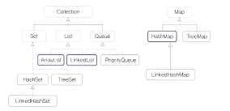

## Collection 인터페이스

Collection 인터페이스를 구현한 클래스
- List, Set, Queue 

```java
public interface Collection<E> extends Iterable<E>
```
Collection 인터페이스는 Iterable<E> 인터페이스를 extends


Collection 인터페이스가 Iterable 인터페이스를 확장했다는 의미
- Iterator 인터페이스를 사용해 데이터를 순차적으로 가져올 수 있음

- 배열과 마찬가지로 Collection 인터페이스를 구현한 모든 클래스는 콜론 하나를 이용해 for 루프를 작성할 수 있다.
```java
for(String tempData: list) {
    System.out.println(tempData);
}
```

Collection 인터페이스 주요 메서드 목록

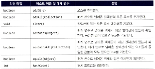

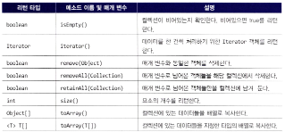


## List 인터페이스

### List 인터페이스를 구현한 클래스

Collection 을 확장한 다른 인터페이스와 List 인터페이스 의 차이점 
- 배열처럼 순서가 있음

List 인터페이스를 구현한 클래스 중 자주 사용되는 것
- ArrayList (JDK 1.2 에 추가)
- Vector (JDK 1.0 부터)
- Stack
- LinkedList

ArrayList, Vector => 확장 가능한 배열
- Vector 는 대부분의 메서드가 ArrayList 와 동일하고 Vector 보다 ArrayList 를 많이 선호한다.
===> 왜 ???? 

ArrayList 와 Vector 의 차이
- ArrayList 는 Thread safe 하지 않고, Vector 는 Thread safe

Stack
- Vector 클래스를 확장해 만들어짐 -> LIFO 지원하기 위함
====> Vector 를 굳이 구현했어야?


### ArrayList 클래스

ArrayList 는 확장 가능한 배열이다. 배열처럼 사용하지만, 대괄호는 사용하지 않고 메서드를 통해 객체를 넣고, 빼고, 조회한다.

[ArrayList 클래스의 상속 관계]  
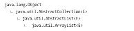

AbstractCollection 은 Collection 인터페이스 중 일부 공통적인 메서드를 구현해놓은 것

[ArrayList 가 구현한 인터페이스들]  
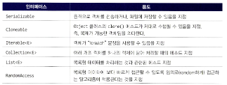

각 인터페이스에서 선언한 기능을 ArrayList 에서 사용할 수 있음

[ArrayList 생성자]  
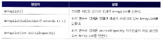

ArrayList 객체를 선언할 때 매개변수를 넣지 않으면 **초기 크기는 10**
- 10개 이상 데이터가 들어가면 크기를 늘리는 작업이 ArrayList 내부에서 자동으로 수행 -> 애플리케이션 성능에 영향
- 저장되는 데이터크기가 어느정도 예측 가능하면 예측한 초기 크기를 지정할 것이 권장
  ```java
  ArrayList list1 = new ArrayList(100);
  ```

[Shallow copy 와 DeepCopy]
- 원본 객체의 주소값만을 할당하는 것은 Shallow copy
- 객체의 모든 값을 복사해 복제된 객체에 있는 값을 변경해도 원본에 영향이 없도록 할 때는 Deep copy
```java
// 1: shallow copy 복사된 리스트와 원본리스트가 동일한 주소값 참조
ArrayList<String> list2 = list;
// 2: shallow copy  why? => 원본 리스트와 복사본 리스트가 서로 다른 주소값을 참조하지만, 내부 요소들은 객체의 참조(주소값)가 복사 -> 원본의 요소를 "수정" 하면 복사본에서도 반영
ArrayList<String> list2 = new ArrayList<String>(list);
```
2번처럼 ArrayList 에는 Collection 인터페이스를 구현한 어떠한 클래스도 포함시킬 수 있는 생성자가 있기 때문에 생성자를 이용한 복사도 가능하다.

왜 Collection을 매개변수로 갖는 생성자와 메소드가 존재할까?
- ArrayList 뿐만 아니라 Set, Queue 를 이용해 데이터를 담을 수도 있으므로 Collection 으로 받는 것


[배열로 변환]

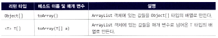

매개변수가 없는 toArray() 메서드는 Object 타입의 배열로만 리턴하기 때문에, 제네릭을 사용해 선언한 ArrayList 객체를 배열로 생성할 때는 toArray(T[] a) 를 사용하는 것이 좋다.
- toArray() 메서드의 매개변수로 변환하려는 타입의 배열을 지정

이때 크기가 0인 배열을 넘겨주는 것이 가장 좋다.
- list.toArray(new String[0]);

==> 이유

```java
// 실제로 매개변수로 넘긴 객체에 값을 담아준다.
// 1) ArrayList 객체의 데이터크기가 매개변수로 넘어간 배열 객체의 크기보다 클 경우
//  => 매개변수로 배열의 모든 값이 null 로 채워짐
// 2) 매개변수로 넘긴 배열의 크기가 더 클경우, 배열의 남는 부분은 null 로 채워짐

// 1)
String[] tempArr = new String[2];
strArr = list.toArray(tempArr);
// [A, B, C, A]
System.out.println(Arrays.toString(strArr));
// [null, null]
System.out.println(Arrays.toString(tempArr));

// 2)
tempArr = new String[7];
strArr = list.toArray(tempArr);
// [A, B, C, A, null, null, null]
System.out.println(Arrays.toString(strArr));
// [A, B, C, A, null, null, null]
System.out.println(Arrays.toString(tempArr));
```

매개변수로 넘긴 객체로 받아오는 것 보다 어차피 toArray(T[] a) 에서 배열을 반환하니까 타입만 지정해주기 위해 크기가 0 인 배열을 집어넣고
toArray() 의 결과를 다른 배열로 받는게 제일 깔끔한 것 같다.


[데이터 추가]  
add(E e): 하나의 데이터를 담을 때
- 배열 가장 끝에 데이터를 담음
- 리턴되는 boolean 값은 제대로 추가되었는지 여부로 대부분 true
add(int index, E e): 
- 지정된 index 위치에 데이터를 담음
- 지정된 위치에 있는 기존 데이터들은 위치가 하나씩 뒤로 밀려남
addAll(Collection<? extends E> c): Collection 을 구현한 객체를 한꺼번에 담을 때
- list2.addAll(list1) 로 list1 의 데이터를 맨 뒤부터 차례로 추가

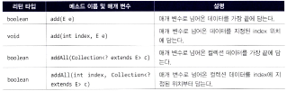

[데이터 조회]  
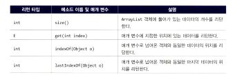

indexOf(Object o)
- 매개변수로 넘어온 객체와 동일한 데이터의 위치를 반환
lastIndexOf(Object o)
- 매개변수로 넘어온 객체와 동일한 마지막 데이터의 위치를 리턴

앞에서부터 찾을 때는 indexOf(), 뒤에서부터 찾을 때는 lastIndexOf() 사용

[데이터 삭제]  
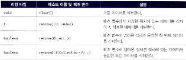

clear(): 모든 데이터 삭제

remove 와 get 의 차이
- remove(int index) 메서드는 get 메서드와 동일하게 지정한 위치의 데이터를 반환하지만
- 그 위치의 데이터를 지우고 리턴한다.

remove(Object o): 매개변수에 넘어온 객체와 동일한 **첫 번째 데이터만** 삭제

removeAll(Collection<?> c): 매개변수로 넘어온 컬렉션 객체에 있는 데이터와 **동일한 모든 데이터** 삭제
```java
public void removeAll() {
    // [A,B,C,A]
    ArrayList<String> list = setUp();
    ArrayList<String> list2 = new ArrayList<>();
    list2.add("A");
    list2.add("B");
    // list 에서 list2 에 포함된 A,B 를 모두 삭제
    list.removeAll(list2);
    // C 만 남아있음
    for(var e: list) System.out.println(e);
}
```

[데이터 변경]

set(int index, E element): 
- 지정한 위치에 있는 데이터를 두 번째 매개변수로 넘긴 값으로 변경
- 해당 위치에 기존에 존재했던 데이터 반환

특정 위치에 있는 데이터를 삭제하고, 그 위치에 데이터를 넣는 작업을 set 메서드 하나로 끝낼 수 있다.
- remove() 후 add() 해야하는게 set() 한번이면 됨

```java
public void set() {
    // [A,B,C,A]
    ArrayList<String> list = setUp();
    String e = list.set(0, "D");
    // A -> A 가 삭제되고, 그 자리에 D 가 들어감
    System.out.println(e);
    // [D,B,C,A]
    System.out.println(list);
}
```

### Stack 클래스

LIFO(Last In First Out) 구현시 필요한 클래스
- Stack 보다 빠른 ArrayDeque 클래스가 존재
- 쓰레드에 안전한 LIFO 기능을 구현해야 한다 = Stack 사용 (ArrayDequeue 는 쓰레드안전 X)

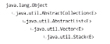

- Stack 클래스는 자바에서 상속을 잘못 받은 클래스 -> 원래 취지인 LIFO 를 생각하면 Vector 에 속해서는 안됨
- JDK 1.0 부터 존재했기 때문에 자바의 하위 호환성을 위해 이 상속관계를 계속 유지하고 있는 것

Stack 클래스에서 구현된 메서드

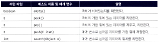

empty()
- 비어있는지 확인
push(E item)
- 가장 위에 저장
search(Object o)
- 매개변수로 넘어온 데이터 위치를 반환

peek() 와 pop() 메서드 차이
- peek() 는 데이터를 반환만 하지만 pop() 은 데이터를 지우고 꺼냄
- 일반적 Stack 클래스 용도에는 pop() 메서드가 더 적합

## Set 인터페이스

### Set 인터페이스를 구현한 클래스

순서에 상관없이, 어떤 데이터가 존재하는지 확인하는 용도로 사용된다.
- 중복되는것을 방지하고, 원하는 값이 포함되어 있는지 확인

배열에서 indexOf 로 확인, 존재하지않으면 add() -> set 을 이용하면 데이터 추가만 하면 됨

HashSet: 
- 순서가 전혀 필요없는 데이터를 해시테이블에 저장 
- Set 중 가장 성능이 좋음
TreeSet: 
- 저장된 데이터의 값에 따라 정렬되는 Set
- red-black tree 타입으로 값이 저장되면 HashSet 보다 약간 성능이 느리다.
LinkedHashSet:  
- 저장된 순서에 따라 값이 정렬되는 Set
- 연결된 목록 타입으로 구현횐 해시테이블에 데이터를 저장. 

데이터 정렬때문에 성능 차이가 발생 -> HashSet 이 별도 정렬 작업이 없어 제일 빠른 것

### HashSet 클래스

[상속관계]

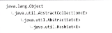

List 에는 정의되어있지만, Set 에는 정의되어있지 않은 메서드
- Set 은 순서가 없으므로 순서가 매개변수로 넘어가는 메서드나, 수행결과가 데이터의 위치와 관련된 메서드는 필요없음
- get(int index), indexOf(Object o) 등

[HashSet 생성자]

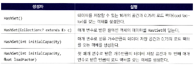

기본적으로 
- 저장공간은 16개
- 로드팩터 0.75
생성자를 통해 조정할 수 있다.
- 로드팩터를 건드릴 필요가 없다면 매개변수가 없는 첫번째 생성자를 사용하거나, 세번째 초기 크기만 지정하는 생성자 사용

[로드 팩터(load factor)]  
load factor는 해시 테이블의 저장공간이 얼마나 차야 해시 테이블의 크기를 자동으로 늘릴지를 결정하는 값이다.  
- 해시 테이블이 얼마나 채워지면 테이블의 크기를 증가시킬 것인지를 결정하는 기준
- 데이터의 개수가 증개해 로드팩터보다 커지면, 저장공간의 크기는 증가되고, 해시 재정리작업(rehash) 를 해야함
  - 자바의 HashSet 및 HashMap에서 기본 load factor는 0.75 (해시 테이블이 75% 차게 되면, 테이블의 크기를 2배로 확장)
- 데이터가 해시 재정리작업에 들어가면 내부에 가지고 있는 자료구조를 다시 생성하는 단계를 거쳐야 하기떄문에 성능에 영향을 미침

```
load factor = 데이터개수/저장공간
```
- HashSet이 16개의 버킷을 가지고 있고, 여기에 14개의 요소가 저장되어 있다면, load factor는 14/16 = 0.875
- 이 값이 설정한 loadfactor 값을 넘으면(기본값 0.75), 테이블이 확장

버킷 사이즈 숫자를 넘는 값이 들어올 경우 모듈러 연산을 통해 해싱되니 들어간 값은 정렬이 되지않는다.
- 참고: https://baebalja.tistory.com/621

로드팩터가 크면?
- 데이터개수가 더 많이 들어갈 수 있지만, 데이터를 찾는 시간이 증가 (해시 구조니까)

[주요 메서드]

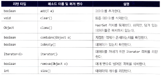

추가: add()   
개수파악: size()    
특정 데이터 존재여부 확인: contains(Objet o)  
비었는지 확인: isEmpty()  
특정 데이터 삭제: remove(Object o)  
전체 삭제: clear()  

## Queue 인터페이스

Queue 는 여러 쓰레드에서 들어오는 작업을 순차적으로 처리할 때 많이 사용된다.

### LinkedList 클래스

LinkedList 는 List 인터페이스뿐아니라 Queue 와 Deque 인터페이스도 구현한다.
- LinkedList 자체가 List 이면서, Queue, Deque 처럼 쓸 수 있음

Deque: Queue 인터페이스를 확장해 Queue 의 기능을 전부 포함하고, 맨 앞에 값을 넣거나 빼는 작업, 맨 뒤에 값을 넣거나 빼는 작업을 수행하는데 용이하게 구성되어 있다.


배열의 경우 위치로 데이터를 찾으므로, 앞의 값을 삭제하면 그 뒤에 있는 값들은 하나씩 앞으로 위치를 이동해야 한다.
LinkedList 를 사용하면 중간에 있는 데이터를 삭제하는 경우 지운 데이터 앞에 있는 데이터와 뒤에 있는 데이터를 연결하면 된다.
- 위치를 맞추기 위해 이동할 필요가 없다.

[상속관계]  
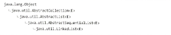

ArrayList 나 Vector 클래스와 달리 AbstractSequentialList 가 부모 클래스  
AbstractList 와 AbstractSequentialList 차이점
- add(), set(), remove() 메소드에 대한 구현 내용이 상이

[구현한 인터페이스]  
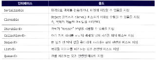

List 와 Deque(Double Ended Queue) 모두의 기능을 구현
- Deque 인터페이스도 구현하므로 맨 앞과 끝의 데이터를 쉽게 처리할 수 있음 (Deque 는 Queue 를 구현하니까 Queue 의 기능도 물론 다 사용가능)

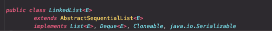

LinkedList 는 일반적인 배열 타입 클래스와 다르게 생성자로 객체를 생성할 때 처음부터 크기를 지정하지 않는다.
- 데이터들이 앞뒤로 연결되니까, 미리 공간을 만들어놓을 필요가 없음

[생성자]  
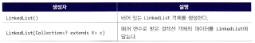

[데이터 추가]  
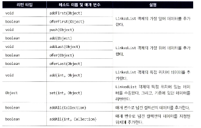

List, Deque 모두를 구현한만큼 메서드가 많이 있다.

여러 매서드를 혼용해서 쓰면 읽는 사람도 이해하기 힘들기 떄문에 오해의 소지를 줄이기 위해 add 가 붙은 메서드를 사용하는 것이 권장된다.  

맨 앞에 추가
- addFirst(E e) 
맨 뒤에 추가
- addLast(E e)

[데이터 조회]  
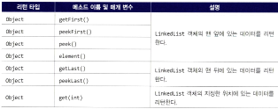

맨 앞 데이터 조회
- getFirst()

인덱스 위치 데이터 조회
- get(int index)

맨 뒤 데이터 조회
- getLast()

[포함 확인]  
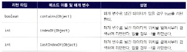

데이터가 있을경우 true 반환
- contains(Object o)

앞에서부터 검색해 반환 (없으면 -1)
- indexOf(Object o)

뒤에서부터 ""
- lastIndexOf(Object o)

[삭제]  
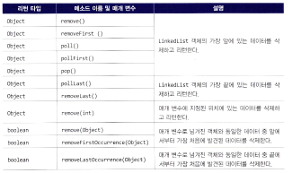

가장 앞에 있는 데이터를 삭제하고 반환
- removeFirst()

가장 끝에 있는 ""
- removeLast()

지정된 인덱스 위치에 있는 데이터를 삭제하고 반환
- remove(int index)

매개변수로 넘겨진 객체와 동일한 데이터 중 앞에서부터 가장 처음 발견된 데이터 삭제
- removeFirstOccurrence(Object o)

"" 가장 뒤에서부터 "" 
- removeLastOccurrence(Object o)


[객체를 하나씩 검색 (ListIterator)]

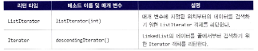

- previous()는 현재 커서 위치에서 "왼쪽"에 있는 요소를 반환하고, 커서를 그 요소의 "앞"으로 이동
- next()는 현재 커서 위치에서 "오른쪽"에 있는 요소를 반환하고, 커서를 그 요소의 "뒤"로 이동

listIterator(index)를 호출하면, 커서는 **index에 해당하는 요소의 "앞"**에 위치
```java
// 커서를 2번 인덱스인 C 앞에 위치
ListIterator<String> iterator = link.listIterator(2);
```
예시로 보면
```

[A, B, | C, D, E, F]
        ↑
      커서 위치

```

```java
// [A, B, C, D, E, F]

// B, A
while (iter.hasPrevious()) {
    System.out.println(iter.previous());
}

// C, D, E, F
iter = link.listIterator(2);
while(iter.hasNext()) {
    System.out.println(iter.next());
}
```

## Map 인터페이스


### Map 인터페이스의 주요 메서드
- key, value 쌍
- 키는 Map 에서 고유, 값은 중복 상관없음

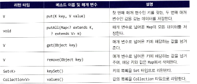

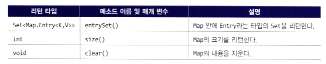

### Map 을 구현한 주요 클래스

- HashMap
- TreeMap
- LinkedHashMap 
- HashTable

HashTable 의 경우 Map 인터페이스를 구현하긴 했지만, 다른 클래스들과는 다르다.
- Map 은 컬렉션 뷰(Collection view) 사용, Hashtable 은 Enumeration 객체 통해 데이터 처리
- Map 은 key, value, (key,value)쌍 으로 데이터를 순환해 처리할 수 있지만 Hashtable 은 (key,value)쌍으로 데이터 순환해 처리할 수 없음
- Map 은 이터레이션 도중 안전하게 데이터 삭제 가능, Hashtable 은 불가

[HashMap 클래스와 Hashtable 클래스 차이]  


자바에 Collection 인터페이스는 JDK 1.2부터
- HashMap 과 TreeMap 은 이때 만들어져 사용되고 있었음
LinkendHashMap 은 JDK 1.4 에서 추가
HashTable 은 JDK 1.0부터 만들어져 사용된 클래스기떄문에 JDK 1.2 에서 Map 인터페이스 기능을 구현되도록 보완된 것이기 때문

[어떤 작업을 할 때 어떤 클래스를 사용해야 하는가?]

HashTable 을 제외한 Map으로 끝나는 클래스들을 여러 쓰레드에서 동시에 접근해 처리할 필요가 있을 때 아래처럼 선언해 사용해야 한다.

```java
import java.util.Collections;
import java.util.HashMap;

Map m = Collections.synchronizedMap(new HashMap<>(...));
```

JDK 1.0 부터 제공되는 Hashtable 과 Vector 는 스레드 안전하게 개발되어 있음
JDK 1.2 부터 제공되는 대부분 Collection 클래스는 위처럼 스레드안전하게 처리해야함
- 또는 이름에 Concurrent 가 포함된 클래스 사용 (ex ConcurrentHashMap, CopyOnWriteArrayList 는 java.util.concurrent 패키지 소속)


### HashMap 클래스

[상속 관계]  
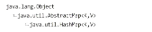

[구현한 인터페이스]  
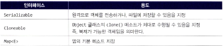

[생성자]  
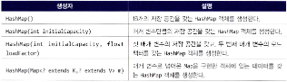

대부분 HashMap 객체를 생성할 때는 매개변수가 없는 생성자를 사용한다. HashMap 에 담을 데이터의 개수가 많은 경우 초기 크기를 지정해주는 것이 권장된다.

[HashMap 에 저장되는 키가 되는 객체를 직접 만들었을 때]
HashMap 의 키는 기본자료형, 참조형 모두 가능
- 직접 어떤 클래스를 만들어 그 클래스를 키로 사용할때는 Object 클래스의 hashCode() 와 equals() 메서드를 잘 구현해두어야 함
- HashMap 에 객체가 들어가면 hashCode() 메서드의 결과값에 따른 bucket 이라는 list 에 들어감
- 서로 다른 키가 저장되었는데, hashCode() 메서드의 결과가 동일하면 이 버켓에 여러 개의 값이 들어갈 수 있음
- get() 메서드가 호출되면 hashCode() 의 결과를 확인하고, 버켓에 들어간 목록에 데이터가 여러개일 경우 equals() 메서드를 호출해 동일한 값을 찾음

[HashMap 주요 메서드]
대부분 Map 인터페이스에 정의되어 있는것 그대로 사용

저장: put(k key, V value) -> 새로운 값을 추가하거나, 기존 값을 수정할때 모두 put 메서드를 사용  
조회: get(Object key) -> Map 에서 존재하지 않는 키로 get() 을 할 경우 **null을 리턴**한다.
삭제: remove(Object key)  
  
키를 가져와야 할 경우: keySet()  
값만 필요할 경우 values()  
키와 값을 모두 가져와야 할 경우 entrySet()  -> Set<Map.Entry<,>> 타입

```java
// 키를 가져와야 할 경우 keySet() 메서드 사용
Set<String> keySet = map.keySet();
for(String tempKey : keySet) {
    System.out.println(tempKey + " : " + map.get(tempKey));
}

 
// String[] value = map.values(); Collection<String> 타입
Collection<String> value = map.values();
for(String tempValue : value) {
    System.out.println(tempValue + " : " + tempValue);
}

// 키와 값을 모두 가져와야 할 경우 entrySet() 메서드 사용
Set<Map.Entry<String, String>> entries = map.entrySet();
for(Map.Entry<String, String> tempEntry : entries) {
    System.out.println(tempEntry.getKey() + " : " + tempEntry.getValue());
}
```
map 의 entrySet() 을 호출하면 Set 타입으로 리턴하며, 그 Set 내에는 Entry 타입으로 데이터가 저장된다.

키존재여부 검사: containsKey()   
값 존재여부 검사: containsValue()
- 둘다 boolean 타입 반환
- get() 메서드로 해당 키나 값이 존재하는지 확인하는것보다 containsKey() 나 containsValue() 메서드를 사용하는게 효과적임
  - 코드를 읽는 사람이 존재여부를 확인한다는 의도를 명확히 알 수 있음
  - get() 에서 null 을 반환할 때 NullPointerException 에 의한 문제

데이터 개수 확인: size()


### TreeMap 클래스

HashMap 객체의 키를 정렬하려면 Arrays 클래스를 사용해 정렬해야한다.
- 불필요한 객체가 생기는 단점

TreeMap 을 사용하면 저장하면서 키를 정렬한다.
- 문자열 정렬 순서: 숫자 -> 알파벳 대문자 -> 알파벳 소문자 -> 한글 (객차나 숫자가 저장될 때는 순서가 달라짐)

매우 많은 데이터를 TreeMap 을 이용해 보관하고 처리할때는 HashMap 보다 느릴 것이다.
- 키가 정렬되는 비용

100건, 1000건 정도 데이터를 처리하고, 정렬을 해야 할 필요가 있다면 HashMap 보다 TreeMap 을 사용하는것이 더 유리하다.

TreeMap 은 어떻게 데이터가 정렬되는걸까?
- SortedMap 인터페이스를 구현했기 때문 -> SortedMap 인터페이스를 구현한 클래스들은 모두 키가 정렬되어 있어야만 함

firstKey(), lastKey(), higherKey() (특정 키 뒤에 있는 키), lowerKey() (특정 키 앞에있는 키) 등 메서드를 제공한다.

### Map 을 구현한 Properties 클래스

애플리케이션에서 사용할 여러 속성들을 Properties 클래스를 사용해 데이터를 넣고, 빼고 저장하고 읽을 수 있다.
- Properties 클래스가 없다면 직접 파일을 읽고 쓰는 메서드를 만들어야 함

Properties 클래스는 Hashtable 을 extends
- Map 인터페이스에서 제공하는 모든 메서드를 사용할 수 있음 (hashtable 이 Map 을 implement 하니까)
자바에에서 시스템 속성을 Properties 클래스를 이용해 제공한다.

```java
// System 클래스에 static 으로 선언되어있는 getProperties 메서드를 호출하면 Properties 타입의 객체를 리턴
  Properties props = System.getProperties();
  Set<Object> keySet = props.keySet();
  for (Object tempObject : keySet) {
      System.out.println(tempObject + "=" + props.get(tempObject));
  }
}
```

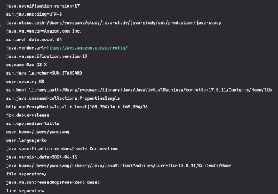
- Hashtable 을 확장한 클래스기 떄문에 키와 값 형태로 데이터가 저장되어 있음


[주로 사용될 값들]  
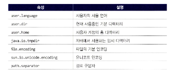  
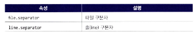
- 대부분이 디렉터리나 파일과 관련된 값들 (IO 관련 클래스의 상수로 정해져 있지만, 간단하고 빠르게 시스템의 속성을 확인하려면 위 메서드들 이용)

Hashtable 이나 HashMap에 있는 속성을 사용하지 않고 굳이 Properties 클래스를 사용하는 이유
- 아래 추가로 제공되는 메서드들 때문

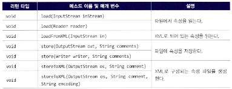
- comments 매개변수들은 저장되는 속성 파일에 주석으로 저장

## References
- 자바의 신 (vol2)


