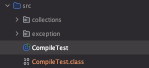

## 자바 컴파일 및 실행

### -cp 옵션

cp 옵션은 클래스패스(classpath)를 설정하는 옵션이다.
classpath는 자바 실행 환경(JVM)이 컴파일된 클래스(.class) 파일이나 의존 라이브러리(.jar 파일)를 찾는 경로를 지정하는 데 사용된다.

컴파일시 
- javac는 컴파일하려는 소스 파일이 의존하는 .class 파일이나 라이브러리(.jar)를 클래스패스에서 찾으므로 -cp 옵션으로 컴파일에 필요한 경로를 지정

실행시
- java는 실행하려는 프로그램에서 필요한 .class 파일이나 JAR 파일을 클래스패스에서 찾으므로 -cp 옵션으로 실행에 필요한 경로를 지정

```java
java -cp [클래스패스] [패키지명.클래스명]
```

클래스패스가 여러 개인 경우 경로를 :(Linux/Mac) 또는 ;(Windows)로 구분한다.

[예시]

out 과 lib/mylib.jar 을 클래스패스에 추가
```java
java -cp out:lib/mylib.jar com.example.Main
```
- out: Main.class 가 있는 위치
- lib/mylib.jar: 라이브러리 파일 위치


### pacakge 선언이 없는 경우 컴파일 및 실행



```
javac CompileTest.java
java CompileTest  
```


```
// src 상위 경로에서
javac src/CompileTest.java

// java -cp src CompileTest
```
java 명령어는 클래스 이름만 사용해야 하며, 파일 경로나 확장자를 포함해서는 안된다.


### Package 선언이 있는 경우 컴파일 및 실행


collections 패키지 내부의 ListSample 을 컴파일하려면

터미널의 collections 패키지 경로에서 (컴파일할 java 파일이 있는 위치)

```java
javac ListSample.java
```
javac 로 컴파일하면


.class 파일이 생성된 것을 볼 수 있다.

```
java ListSample 
```

실행하려하면 NoClassDefFoundError 가 발생한다. 


```java
package collections;
```
이유는 패키지 선언이 있기 때문이다. 패키지 선언이 있으면 `java -cp` 와 패키지명을 넣어줘야 한다.

```java
java -cp ../ collections.ListSample  
```
-cp 옵션을 이용해 패키지가 존재하는 경로를 클래스패스에 추가하고, `패키지명.class파일 이름` 으로 실행하면 된다.


## 단일파일을 컴파일할때와 패키지 선언이 있는 파일을 컴파일 할 때 -cp 옵션 유무가 왜 차이날까?

단일 파일의 경우 .class 파일이 현재 디렉토리에 있고, 클래스패스 기본값(.)에서 찾을 수 있기 때문에 -cp 옵션이 필요하지 않다.
패키지 선언이 있는 클래스는 패키지 구조에 따라 저장되므로, 클래스패스를 명시(-cp)하여 JVM이 패키지 디렉토리를 찾도록 해야 한다.


### 별도 컴파일 경로를 지정 (-d 옵션)

클래스패스의 기본값은 터미널에서 명령어를 실행한 현재 작업 디렉토리(working directory)이다.

-d 옵션 없이 컴파일하면, 소스 파일이 위치한 경로에 .class 파일이 생성된다.
즉, 컴파일 명령 실행 위치와 상관없이 소스 파일 경로가 기준이다.

```
// src 경로에서
javac collections/ListSample.java

// src/collections 경로에서
javac ListSample.java
```

둘다 ListSample.java 아래에 .class 파일이 생성된다.


-d 옵션을 사용하면 컴파일된 .class 파일을 특정 디렉토리 구조에 저장하도록 명시적으로 지정할 수 있다.
패키지 구조를 유지하며, 특정 디렉토리로 .class 파일을 생성할 때 사용된다.
```java
// src 경로에서
javac -d ../out collections/ListSample.java
```


out 디렉토리에 생성되는것을 볼 수 있다.

```java
  java -cp ../out collections.ListSample
```
실행하려면 마찬가지로 클래스패스에 out 경로를 지정한다.

### java -cp 명령어로 실행시 경로를 포함할 수 있을까?

Java 명령어로 실행할 때 패키지명.클래스명 형식으로 되어야 한다고 알고 있었다.

따라서 아래처럼 실행해야 정상적으로 실행될 것이라 생각했는데 
```java
// out 상위 경로에서
java -cp ./out collections.ListSample
```


경로로 지정해준 경우에도 정상적으로 실행된다.

이는 java 명령어에서 collections/ListSample과 같은 경로를 입력하면, JVM이 이를 점(.)으로 변환해 처리하기 때문이다.
표준 방식은 점(.)을 사용한 패키지명.클래스명 이므로 표준 방식을 사용하는게 좋을 것 같다.


### 정리

- class path 기본값은 명령어를 실행한 working directory 이다.
- package 선언이 있을 경우 -cp 옵션으로 패키지 경로를 클래스패스에 넣어줘야 한다.
- package 선언이 없을 경우 java 파일이 존재하는 디렉터리에서 컴파일 후 실행하면 class path 기본값에 의해 실행에 문제가 없다.


