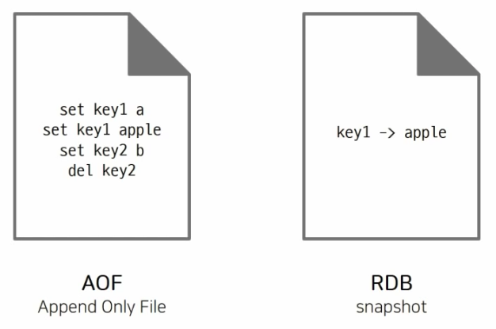

# 데이터 영구 저장(Redis Persistence)

Redis는 메모리 기반의(in-memory) 데이터 저장소기 때문에 서버가 재시작될 경우 모든 데이터가 사라진다. 
복제 기능을 사용해도 실수로 인한 데이터 복구가 불가능하므로 캐시 이외의 용도로 사용한다면 적절한 데이터 **백업**이 필요하다.
이를 위해 Redis에서는 데이터 영속성을 보장하는 두 가지 주요 방식인 RDB와 AOF 를 제공하고 있다.

## AOF (Append-Only File)

### 개념
변경 커맨드를 순서대로 저장하여 모든 데이터 변경 내역을 보관하는 방식이다.
- RDB파일보다 규모가 크며, 주기적으로 압축 + 재작성 과정이 필요하다.
- 실제 AOF 파일은 Redis 프로토콜 형태로 저장되며, 사람이 읽을 수 있는 형태로 각 명령어를 기록한다.
  
### 설정 방식

자동 설정
- redis.conf 파일의 auto-aof-rewrite-percentage 옵션을 통해 자동으로 파일을 재작성할 수 있다.
- 파일의 크기가 지정된 퍼센트만큼 증가할 경우 자동으로 AOF 파일을 재작성하도록 설정된다.

수동 설정
- BGREWRITEAOF 커맨드를 CLI에서 직접 입력하여 수동으로 AOF 파일을 재작성할 수 있다.

### 장단점

장점: 최근 데이터까지 세밀하게 복구 가능하며, 데이터 손실 가능성을 최소화한다.
  
단점: 로그 파일이 점점 커질 수 있으므로 주기적인 압축 및 재작성이 필요하다.

###  RDB (Redis Database)

### 개념
RDB는 스냅샷처럼 특정 시점의 메모리 데이터를 통째로 파일로 저장하는 방식이다.
- 바이너리 파일 형태로 저장 -> 직접 읽을 순 없다.

### 설정 방식

자동 설정
- redis.conf 파일에서 SAVE 옵션을 통해 자동으로 저장할 수 있다. 
- ex) SAVE 900 1은 900초(15분) 동안 1개 이상의 키가 변경될 경우 자동으로 RDB 파일을 생성하라는 설정이다.

수동 설정
- BGSAVE 커맨드를 사용하여 CLI에서 직접 RDB 파일을 생성할 수 있다. 
- 단, SAVE 커맨드는 Redis가 차단되는 블로킹 이슈가 발생할 수 있으므로 **절대 사용하지 않는 것이 권장**된다.

## RDB vs AOF 선택 기준

캐시 용도로만 사용한다면
- 사용하지 않는다. 백업 기능은 불필요하며, 저장 공간 낭비가 될 수 있다. 
  
백업은 필요하지만 약간의 데이터 손실을 허용할 수 있는 경우
- RDB 단독 사용 추천
- SAVE 옵션을 적절하게 변경해서 사용한다.
  
장애 상황 직전까지 모든 데이터가 보장되어야 할 경우
- AOF 사용 (appendonly yes)
- APPENDFSYNC 옵션이 everysec인 경우 최대 1초 사이의 데이터 유실 가능성이 있다. (default 세팅 값)
  
제일 강력한 내구성(무손실을) 이 필요한 경우 둘 다 동시에 사용하면 된다.