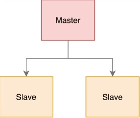
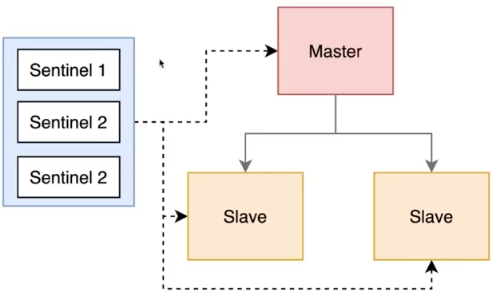
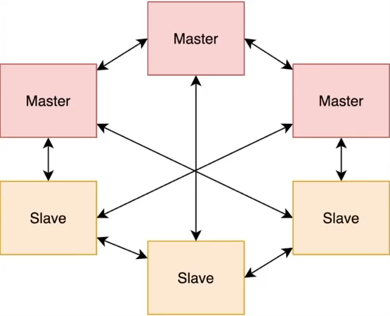

## Redis Replication

Redis 는 서버가 꺼지면 데이터가 날아간다는 가정 하에 사용하기 떄문에 Application 레벨에서도 데이터가 없으면
없는걸 다시 채우던가 없어도 비즈니스 로직이 돌게끔 로직을 짜야 한다. 애플리케이션 코드를 잘짜야한다.

Redis 가 분산처리를 하는 방식

고가용성을 제공하기 위한 기본적인 Master-Slave 구조로 이루어진다.
- Master: 데이터 읽기/쓰기
- Slave: Master 의 데이터를 복사해 읽기만 제공

Master 에 장애가 발생하면 쓰기 요청은 모두 실패한다.
- Slave는 계속 Master에 읽기 요청을 하지만 실패

Redis 는 주로 쓰기보다는 읽기 위주로 작업하기 때문에 Master 는 하나만 있어도 문제 없다.
Slave 노드를 여러개 추가할 수 있는 구조라 읽기를 빠르게 제공할 수 있다.
- Master 에서 Slave 로 Copy 되는 시간이 1~2초 정도 소요 -> 이 시간동안 트랜잭션 처리 등 문제가 될 수 있다.

인기 글 Push 를 보냈는데 Master 에는 해당 데이터가 들어있지만 Slave 에 해당 데이터가 들어있지 않는 경우
사용자는 푸쉬알림을 받았는데, 인기글이 없다고 보여질 수 있다.

Slave 까지 데이터가 Copy 되었는지 확인하고 알림을 보내도록 구성하는게 좋다. 
- 힘들다면 1분 뒤에 보내던지 로직을 구성해야 한다.

Replication 방식은 잘 사용하지 않는데, Master 에 장애가 발생한다면 Slave 는 계속 Master 에 읽기 요청을 하지만 실패하고 Slave 도 죽을 수 있다.

## Redis Sentinal

Master-Slave 구조에서는 Master에 장애가 났을 때 Slave 를 Master 로 승격시키기도 애매하고 빠르게 Master 노드를 복구하는게 우선순위였음

이를 보완한 방식이 Redis Sentinal 이다.

Master 노드의 장애를 감지하는**별도의**Sentinel 노드를 두는 방식이다.

Master-Slave 구조에서 Master 장애 시 자동 장애 조치(auto failover) 를 수행한다.
- Sentinel 노드 과반 수 이상이 Master 장애를 감지하면 Slave 중 하나를 Master 로 승격

비교적 설정이 쉽고 기존 Redis 구조에 Sentinel 만 추가하면 된다.

Sentinel 노드
- Redis 서버를 지속적으로 모니터링
- client 가 올바른 노드를 찾을 수 있도록 도움
- 최소 3개 이상의 노드를 권장 -> 과반 수 이상이 장애 감지시 승격하므로 홀수 개로 구성 
- Redis 와 동일한 노드에 구성해도 되고 별도 구성도 가능
  - 동일한 노드에 구성한다는 의미는 Sentinel 을 Master, Slave 각각에 설치한다는 의미
  - Redis 자체가 CPU 를 많이 먹지 않아서 Sentinel 과 함께 두 개를 같이 돌리기도 함
  - 보통은 서버를 하나띄우고 거기서 컨테이너로 관리한다던지 함

굳이 감시만 하는 역할의 Sentinel 노드를 두어야 한다.

그럼에도 사용 이유
- 설정이 간단해 빠르게 적용 가능 -> 기존 Master-Slave 구조에서 Sentinel 만 추가

client 가 읽기 작업을 할때는 slave 를, 쓰기 작업을 할때는 Master 를 바라보게끔 라우팅을 해줄 수 있다.

Redis Sentinel 문제점

일반적으로 단인 Master 로 구성한다. 
Master 하나가 모든 쓰기 작업을 처리해야 한다.
- 대규모 쓰기 작업시 병목 발생 -> Master 노드의 CPU 나 메모리가 부족하면
- Slave 에 복제되는 Latency 증가

## Redis Cluster

대규모 시스템의 경우 사용하는 방식

수평 확장을 통해 데이터 분산(shard) 및 고가용성(auto failover)를 제공
- 최소 3개의 Master Node 필요
- 각 Master Node 마다 최소 하나 이상의 Slave Node 필요 

설정과 관리가 매우 복잡하고 특정 작업은 일부 제한이 있을 수 있다.
- 데이터는 1638개 슬롯으로 나뉘어 특정 Master 에 할당된다.
- 모든 데이터는 Master 단위로 공유되고 Slave 단위로 복제된다. =  슬롯으로 sharding 

쓰기작업 자체를 분산시키겠다 하면 Redis 를 클러스터방식으로 Master 3개로 구성하지 않고 별도의 Redis 싱글 노드를 3개 운영하는게 나을 수도 있다.
-> ???

Master노드끼리 통신해야하는 리소스가 필요하고 싱크가 깨질 수도 있다.
Master 노드만으로 구성하려면 차라리 별개 Redis 서버를 구성한다.

Elastic Search 는 Active Stanby 상태로 Master 노드가 구성되어 있다. 

