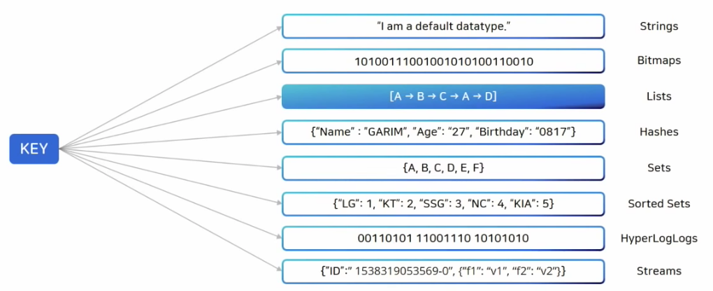

# Redis 자료구조





어떤 사용자에게 보내줘야 할지 

아래같은 Json 이 있다면 이걸 텍스트 처리 후 삽입하고, 
````json
{
    "text": "내용",
    "userId": 1
}
```
꺼낸 후 다시 디코딩해서 json 으로 받는다.
```
RPUSH push_noti  { .. }
```

메시지큐까지 써야 하는 규모의 서비스라면 복잡하더라도 이렇게 만들어야 한다.
간혹가다 잘못 String 으로 변환해서 넣어두면 Consumer 에서 Exception 이 발생한다.
- 모니터링을 해야한다.

메시지큐 방식이 부하분산에 좋겠지만 모니터링을 해야하기 때문에 골치아픈 부분이 있다.

의존성 추가

```
implementation 'org.springframework.boot:spring-boot-starter-data-redis'
```

application.yml 설정
```
spring:
  data:
    redis:
      port: 6377
      host: localhost
```

RedisConnection: 
- redis 백엔드와의 통신
- 연결과 관련된 라이브러리 예외를 자동으로 스프링의 consistent exception hierarchy로 변환


RedisStandaloneConfiguration
- 단일 Redis 서버를 사용하는 경우에 사용

- Redis Sentinel: RedisSentinelConfiguration 
- Redis Cluster: RedisClusterConfiguration


## Serializer 

key, value 가 저장되는 형식에 대한 직렬화 설정이다.

일반적으로는 아래 처럼 직렬화 방식을 사용한다. (String, List, Set, Sorted Set, Pub/Sub)
- setKeySerializer
- setValueSerializer

Hash 자료구조를 사용할 경우 key, field, value 각각에 대해 설정한다. 
- setKeySerializer 
- setHashKeySerializer
- setHashValueSerializer 

각각 


### GenericJackson2JsonRedisSerializer

- redis value값을 class type 상관없이 값을 불러 올수있다.
- 저장시 클래스 패키지명 등 클래스 타입 전체를 저장하여 **해당 패키지 dto가 아닐경우 이 key값을 조회할수 없는 단점이 있다.**


 


