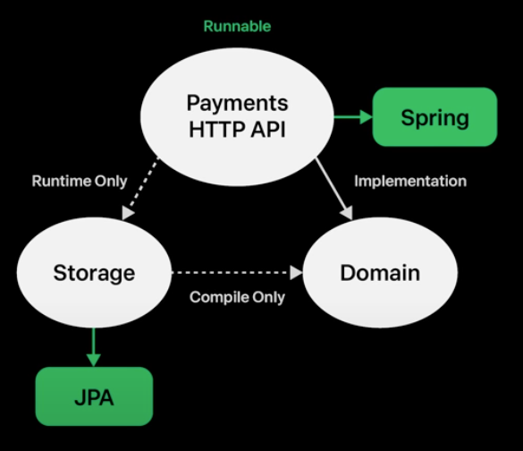

https://www.youtube.com/watch?v=RVO02Z1dLF8

Service 에 라이브러리 의존적인 부분을 제거한다.
-> 모듈을 분리하고 격리한다.

Presentation 레이어부분을 모듈화시켜 격리한다.

Storage 모듈을 런타임으로 의존하게 하고
Storage 모듈은 도메인 모듈의 명세를 까라 구현체의 역할만 하는 구조로 수정한다. 
