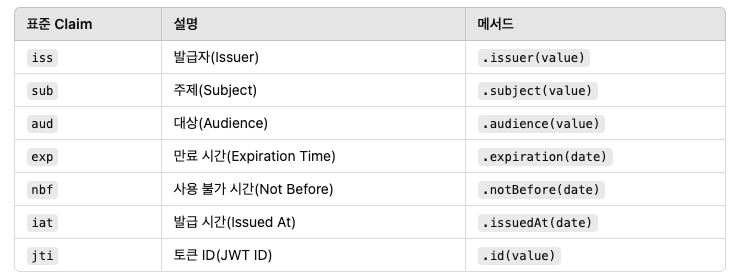

# JJWT (Createing and Reading JWT)

공식문서를 정리한 내용 (`25.1.27 기준 0.12.6`)
- **Creating a JWT:** [https://github.com/jwtk/jjwt?tab=readme-ov-file#creating-a-jwt](https://github.com/jwtk/jjwt?tab=readme-ov-file#creating-a-jwt)
- **Reading a JWT**:[https://github.com/jwtk/jjwt?tab=readme-ov-file#reading-a-jwt](https://github.com/jwtk/jjwt?tab=readme-ov-file#reading-a-jwt)

## JWT 생성

**WT 생성 과정**은  `Header`, `Payload`, `Signature`를 정의하고 `compact()`를 호출하면 된다.

### 생성 방법

1.  `Jwts.builder()` 메서드를 사용하여 `JwtBuilder` 인스턴스를 생성.
2. 필요에 따라 JWT 헤더(Header)에 파라미터를 설정.
3. `JwtBuilder`의 메서드를 호출하여 **Payload**(내용) 또는 **Claims**(정보)를 설정.
4. `signWith`(서명) 또는 `encryptWith`(암호화) 메서드를 호출하여 보안을 적용.
5. `compact()` 메서드를 호출해 최종 JWT 문자열을 생성

```java
String jwt = Jwts.builder()                     // (1)

    .header()                                   // (2) optional
        .keyId("aKeyId")
        .and()

    .subject("Bob")                             // (3) JSON Claims, or
    //.content(aByteArray, "text/plain")        //     any byte[] content, with media type

    .signWith(signingKey)                       // (4) if signing, or
    //.encryptWith(key, keyAlg, encryptionAlg)  //     if encrypting

    .compact();                                 // (5)
```

- **Payload**는 `byte[] 데이터(content)` 또는 `JSON Claims`를 사용할 수 있지만, 둘 다 동시에 설정할 수는 없다.
- **서명(signWith)** 또는 **암호화(encryptWith)** 중 하나만 사용할 수 있으며 둘 다 동시에 사용하면 안된다.
- **서명이나 암호화 없이 JWT를 생성할 경우**, 보안이 없는 JWT(Unprotected JWT)가 생성되며 이는 안전하지 않다.

### Header

header 설정 예제

```java
String jwt = Jwts.builder()

    .header()                        // (헤더 설정 시작)
        .keyId("aKeyId")             // 키 ID 설정
        .x509Url(aUri)               // X.509 URL 설정
        .add("someName", anyValue)   // 커스텀 헤더 추가
        .add(mapValues)              // 다수의 헤더를 Map으로 추가
        .and()                       // JwtBuilder로 돌아감

    .subject("Joe")                  // Payload 설정
    .compact();                      // JWT 생성

```

- `lg`, `enc`, `zip`과 같은 표준 헤더는 JJWT가 자동으로 설정하므로 직접 추가할 필요가 없다.

<aside>

예제에 나온 x509Url 은 무엇일까?

- `x509Url`은 JWT의 헤더(Header) 에 사용될 수 있는 **X.509 인증서**와 관련된 URL을 나타내는 필드
- URL은 JWT를 서명한 키에 대한 X.509 인증서 또는 인증서 체인을 다운로드할 수 있는 위치를 지정하기위해 사용됨
- X.509 인증서는 **공개 키 기반의 디지털 인증서 표준**으로, RSA 또는 ECDSA와 같은 비대칭키 알고리즘에서 주로 사용됩니다. `x509Url`은 JWT를 검증할 때, 공개 키를 얻는 데 사용될 수 있음

⇒ 비대칭키 알고리즘을 사용할 일이 생기면 추후 다시 정리

</aside>

표준 헤더 외의 커스텀 헤더를 추가하려면 `add` 메서드를 사용한다.

```java
Jwts.builder()
    .header()
        .add("aHeaderName", aValue)
        .and();
```

공통으로 사용할 헤더를 별도로 생성해 `JwtBuilder`에서 재사용할 수 있다.

```java
// 공통 헤더 생성
Header commonHeaders = Jwts.header()
    .issuer("My Company")    // 발급자 설정
    .build();                // 빌드

// 공통 헤더 사용
String jwt = Jwts.builder()
    .header()
        .add(commonHeaders)                   // 공통 헤더 추가
        .add("specificHeader", specificValue) // 개별 헤더 추가
        .and()
    .subject("User")
    .compact();

```

### Payload

SON 형식의 **Claims 객체** 또는 **바이트 배열(byte[])** 형식으로 설정할 수 있다. 표준 Claims와 커스텀 Claims를 모두 설정 가능하다. (일단, Claim 형식만 정리)

표준 Claim



```java
String jwt = Jwts.builder()
    .issuer("me")                       // 발급자
    .subject("Bob")                     // 주제
    .audience("you")                    // 대상
    .expiration(new Date(System.currentTimeMillis() + 3600000)) // 만료 시간
    .notBefore(new Date())              // Not Before 시간
    .issuedAt(new Date())               // 발급 시간
    .id("unique-id-12345")              // 토큰 ID
    .compact();

```

표준 Claims 외의 데이터를 추가하려면 `claim` 메서드를 사용한다.

```java
String jwt = Jwts.builder()
    .claim("role", "admin")  // 사용자 역할
    .claim("email", "bob@example.com")  // 이메일
    .compact();
```

여러 Claims 를 Map 으로 추가할 수 있다.

```java
Map<String, Object> claims = Map.of("role", "admin", "email", "bob@example.com");

String jwt = Jwts.builder()
    .claims(claims)  // Map으로 Claims 추가
    .compact();
```

## JWT 읽기

### JWT 읽는 방법

- **JwtParserBuilder 생성**:
    - `Jwts.parser()`를 호출하여 `JwtParserBuilder` 인스턴스를 생성
- **서명 또는 암호화 키 설정**:
    - `keyLocator`, `verifyWith`, `decryptWith` 메서드를 통해 서명 검증 키 또는 암호화 키를 설정 (옵션)
- **JwtParser 빌드**:
    - `build()` 메서드를 호출해 thread-safe 한 `JwtParser*`를 생성
- **JWT 문자열 파싱**:
    - `parse*` 메서드(ex `parseSignedClaims`)를 사용하여 JWT를 파싱
- **예외 처리**:
    - 파싱, 서명 검증, 또는 복호화 실패 시 `JwtException`을 캐치해서 처리

```java
Jwt<?, ?> jwt;

try {
    jwt = Jwts.parser()                     // (1) JwtParserBuilder 생성
             .verifyWith(secretKey)         // (2) 서명 검증 키 설정 (SecretKey 사용)
             .build()                       // (3) JwtParser 빌드
             .parseSignedClaims(token);     // (4) JWT 파싱 (서명된 JWT Claims 파싱)

    // JWT가 유효함, Payload 사용 가능

} catch (JwtException ex) {                 // (5) 예외 처리
    // JWT는 신뢰할 수 없음
}
```

### **키 설정 메서드**

JWT를 읽는 과정에서 서명 검증 또는 암호화 복호화를 위해 키를 설정해야 한다.

1. **`verifyWith(key)`**
    - JWS(서명된 JWT) 의 서명을 검증하기 위해 사용
    - HMAC-SHA 서명된 JWS의 경우, 서명에 사용된 **SecretKey**를 제공
    - RSA 또는 ECDSA 서명된 JWS의 경우, **PublicKey**를 제공
2. **`decryptWith(key)`**
    - JWE(암호화된 JWT)를 복호화하기 위해 사용
    - 암호화에 사용된 비밀키(SecretKey) 또는 비대칭 키의 **PrivateKey**를 제공
3. **`keyLocator(locator)`**
    - 여러 개의 키를 사용하는 경우, JWT를 먼저 검사한 후 적절한 키를 선택하기 위해 `keyLocator`를 설정

### 빌드 및 파싱 메서드

- **`build()`**
    - 설정된 `JwtParserBuilder`를 **스레드 안전한 `JwtParser` 객체**로 변환
- **`parse*` 메서드**
    - JWT의 종류에 따라 적합한 메서드를 사용해 JWT를 파싱
    - 예:
        - **`parseSignedClaims`**: 서명된 JWT의 Claims 파싱
        - **`parseEncryptedClaims`**: 암호화된 JWT의 Claims 복호화 및 파싱
        - **`parse`**: 모든 종류의 JWT에 대해 일반적인 파싱

예를들어, **HMAC-SHA 기반이면** 아래처럼 파싱한다.

```java
Jwts.parser()
    .verifyWith(secretKey)  // 서명 검증용 SecretKey 설정
    .build()
    .parseSignedClaims(jwsString);
```