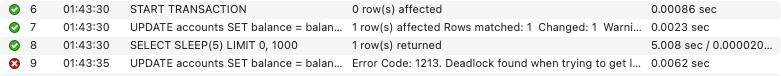
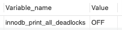

# 데드락(DeadLock) 발생시켜 보기

## 데드락 테스트

개념 처럼 실제로 데드락이 걸리는지 확인해보기 위해 MySQL에서 2개의 Session 으로 데드락이 걸리는 상황을 만들고 테스트해보았다.

트랜잭션이 매우 짧은 시간 안에 처리되기 때문에 데드락이 자연스럽게 발생하는 타이밍을 맞추기 어려워, 데드락 상황을 의도적으로 만들기 위해 SLEEP을 사용했다.
SLEEP으로 각 트랜잭션이 잠시 대기하게 만들면 서로 자원을 잠근 상태에서 동시에 서로의 자원을 요청하는 상황을 만들 수 있다.

아래 처럼 간단한 계좌 테이블을 만들고 데이터를 삽입해준다.
```sql
CREATE TABLE accounts (
    account_id INT PRIMARY KEY,
    balance DECIMAL(10, 2)
);

INSERT INTO accounts (account_id, balance) VALUES (1, 1000.00), (2, 2000.00);
```
트랜잭션 1에서 account_id = 1 의 계좌를 잠그고, account_id =2 의 계좌를 업데이트 시도한다.
```sql
START TRANSACTION;

-- account_id = 1의 계좌를 잠금
UPDATE accounts SET balance = balance - 100 WHERE account_id = 1;

SELECT SLEEP(10);

-- account_id = 2의 계좌를 업데이트 시도
UPDATE accounts SET balance = balance + 100 WHERE account_id = 2;

-- 커밋
COMMIT;
```
트랜잭션 2에서는 반대로 account_id = 2 의 계좌를 잠그고 account_id = 1 의 계좌를 업데이트 시도한다.
```sql
START TRANSACTION;

-- account_id = 2의 계좌를 잠금
UPDATE accounts SET balance = balance + 200 WHERE account_id = 2;

SELECT SLEEP(5);

-- account_id = 1의 계좌를 업데이트 시도
UPDATE accounts SET balance = balance - 200 WHERE account_id = 1;

-- 커밋
COMMIT;
```
두 트랜잭션이 서로의 자원을 기다리면서 순환 대기 상태에 빠지게 되며 이로 인해 아래처럼 데드락이 발생한다. (deadlock_detect: ON)




## MySQL의 데드락 감지 기능

InnoDB 스토리지 엔진에서 데드락 탐지 기능을 활성화하거나 비활성화 할 수 있는데 MySQL 8.0 에서 기본값이 ON 으로 설정되어 있다. ON 으로 설정되어 있으면 데드락이 발생되는 쿼리에서 에러를 보여준다.
```mysql
SHOW VARIABLES LIKE 'innodb_deadlock_detect';
```
.png)

설정을 아래처럼 `SET GLOBAL` 전역 설정 으로 변경이 가능하다. 변경 후에는 새로운 세션부터 적용된다.
```mysql
SET GLOBAL innodb_deadlock_detect = OFF;
SET GLOBAL innodb_deadlock_detect = ON;
```

## MySQL 의 데드락 발생시 처리 방법

InnoDB에서는 데드락 탐지 기능이 활성화되어 있을 때(기본 설정) 데드락이 발생하면 InnoDB가 이 상황을 감지하고, 트랜잭션 중 하나를 롤백(the victim)해 데드락을 해결한다. 
만약 innodb_deadlock_detect 변수를 사용해 데드락 탐지를 비활성화한 경우, InnoDB는 innodb_lock_wait_timeout 설정을 이용해 데드락이 발생할 때 트랜잭션을 롤백하게 된다. 따라서 애플리케이션 로직이 올바르더라도, 트랜잭션이 재시도되어야 하는 경우를 처리해야 한다.

어떤 트랜잭션을 롤백해 데드락 상태에서 빠져나갔는지 확인해보았다.

InnoDB 사용자 트랜잭션에서 발생한 마지막 데드락을 보려면 SHOW ENGINE INNODB STATUS 명령어를 사용한다.
```mysql
SHOW ENGINE INNODB STATUS;
```

.png)

로그 순서대로 나열하면 아래와 같다.
1. 트랜잭션1이 account_id = 2의 레코드를 수정하기위해 UPDATE 쿼리를 실행하고 Lock을 기다리고 있다.
2. 트랜잭션1이 account_id = 2에 대한 X Lock 을 획득한다 (Record Lock)
3. 트랜잭션1이 account_id = 1 에 대한 LOCK 을 기다리고 있지만 트랜잭션 2가 이미 X Lock 을 가지고 있어 대기 상태다.
2. 트랜잭션2가 account_id = 1의 레코드를 수정하기위해 UPDATE 쿼리를 실행하고 Lock을 기다리고 있다.
3. 트랜잭션2가 account_id = 1 X Lock 을 획득한다. (Record Lock)
4. 트랜잭션2가 account_id = 2 에 대한 LOCK 을 기다리고 있지만 트랜잭션 1이 이미 X Lock 을 가지고 있어 대기 상태다.
5. 트랜잭션2가 롤백(ROLL BACK)된다.

트랜잭션1이 account_id=2 에 대한 X Lock 을 획득하고, 트랜잭션2가 account_id=1 에 대한 X Lock 을 획득하고 있는 상황에서
트랜잭션1이 account_i1=1, 트랜잭션2가 account_id=2 에 대한 락을 요청했으므로, 서로가 서로에게 필요한 락을 획득하고 있기 때문에 데드락이 발생한 것을 확인할 수 있다.

이로 인해 트랜잭션2는 롤백되고, 트랜잭션1이 정상적으로 처리된 것을 확인할 수 있다.

## innodb_print_all_deadlocks 

옵션이 활성화 되어 있지 않다면 SHOW ENGINE INNODB STATUS 명령어를 사용하여 **마지막 데드락에 대한 정보만** 확인할 수 있다.
만약 빈번한 데드락이 발생하여 트랜잭션 구조나 애플리케이션 오류 처리에 문제가 있다고 판단되면 innodb_print_all_deadlocks 변수를 활성화해 모든 데드락 정보를 mysqld 에러 로그에 기록하는 방법도 있다.
```mysql
SHOW VARIABLES LIKE 'innodb_print_all_deadlocks'; # 활성화 여부 확인
```


```mysql
SET GLOBAL innodb_print_all_deadlocks = ON; # 활성화
```
InnoDB가 데드락을 감지하고 자동으로 트랜잭션 중 하나를 롤백하기 때문에, 가끔 발생하는 InnoDB 데드락은 반드시 문제가 되는 것은 아니다.
하지만 애플리케이션에 롤백을 감지하고 재시도하는 적절한 오류 처리 로직이 없는 경우, 데드락이 왜 발생하는지 문제를 해결하기 위해 위 옵션을 이용해 로그에 기록할 수 있다.

데드락이 자주 발생하는 경우, DML이나 SELECT ... FOR UPDATE 문을 여러 테이블에 걸쳐 사용하는 트랜잭션의 구조를 재구성하고, 각 트랜잭션이 테이블을 같은 순서로 접근하도록 함으로써 데드락 상황을 피할 수 있다. 


## 공식문서

- [17.7.5 Deadlocks in InnoDB](https://dev.mysql.com/doc/refman/8.4/en/innodb-deadlocks.html)
- [17.7.5.1 An InnoDB Deadlock Example](https://dev.mysql.com/doc/refman/8.4/en/innodb-deadlock-example.html)
- [](https://dev.mysql.com/doc/refman/8.4/en/innodb-parameters.html#sysvar_innodb_print_all_deadlocks)


